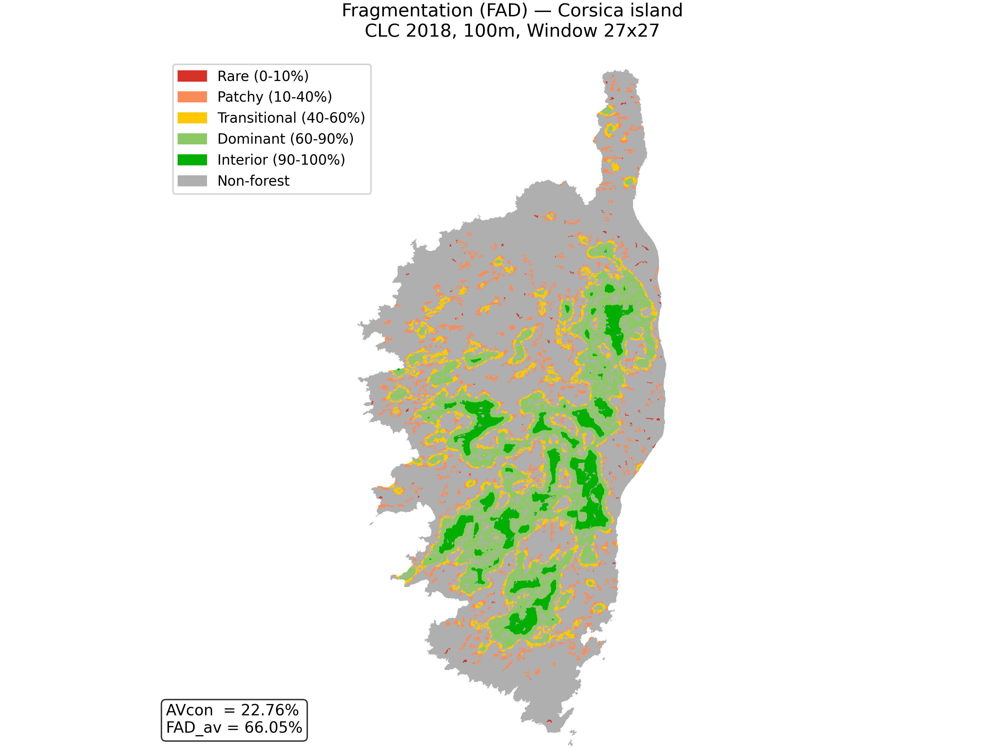
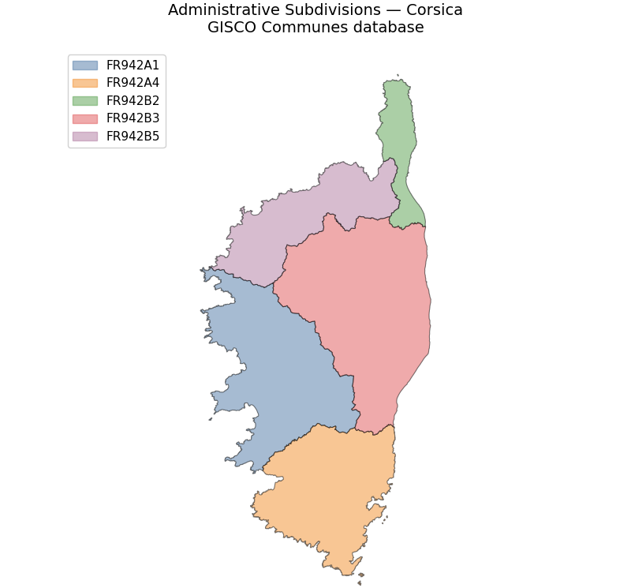
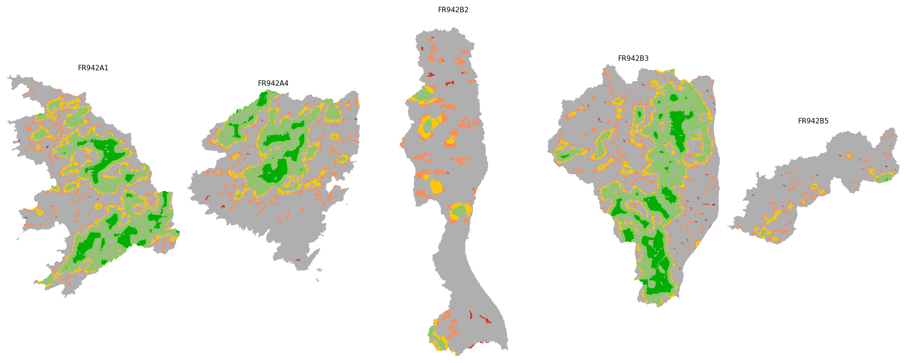

.. |pipeline| image:: https://code.europa.eu/jrc-forest/guidos/pyguidos/badges/main/pipeline.svg?ignore_skipped=true
   :target: https://code.europa.eu/jrc-forest/guidos/pyguidos/-/pipelines
   :alt: Pipeline Status

.. |coverage| image:: https://code.europa.eu/jrc-forest/guidos/pyguidos/badges/main/coverage.svg?job=run_tests
   :target: https://jrc-forest.pages.code.europa.eu/guidos/pyguidos/coverage/index.html
   :alt: Coverage Report

.. |docs| image:: https://img.shields.io/badge/docs-latest-brightgreen.svg
   :target: https://jrc-forest.pages.code.europa.eu/guidos/pyguidos/
   :alt: Documentation Status

.. |pypi| image:: https://img.shields.io/pypi/v/pyguidos.svg
   :target: https://pypi.org/project/pyguidos/
   :alt: PyPI Version

.. |downloads| image:: https://static.pepy.tech/badge/pyguidos
   :target: https://pepy.tech/project/pyguidos
   :alt: Downloads Counter

.. |license| image:: https://img.shields.io/badge/license-EUPL--1.2-orange.svg
   :target: https://joinup.ec.europa.eu/collection/eupl/eupl-text-eupl-12
   :alt: EUPL-1.2 License

|pipeline| |coverage| |docs| |pypi| |downloads| |license|

**pyGuidos** is a Python interface to the main modules of `GuidosToolbox <https://forest.jrc.ec.europa.eu/en/activities/lpa/gtb/>`_ (GTB), 
a scientific software suite developed at the European Commission Joint Research Centre (JRC) for the 
spatial pattern analysis of raster images.

pyGuidos follows the logic of the GTB-based command-line modules `GuidosToolbox Workbench <https://gwbdoc.readthedocs.io/en/latest/>`_ 
providing programmatic access to the main GTB analytical tools, enabling reproducible 
landscape analysis workflows in Python scripts, Jupyter notebooks, and automated pipelines.

.. note::
   This documentation describes **pyGuidos version 2.5.2**. For older versions, 
   please refer to the legacy documentation branch.

Project Infrastructure & Community
----------------------------------

The official upstream development workspace for ``pyguidos`` is hosted on `code.europa.eu <https://code.europa.eu/jrc-forest/guidos/pyguidos>`_, the open-source repository platform of the European Commission. Because this institutional forge restricts issue creation and merge requests to authorized internal accounts (EU Login), public community collaboration is mirrored to GitHub.

.. important::
   **Bug reports and feature requests**
   
   To ensure an open, friction-free environment for the global scientific and GIS community, please do not use the code.europa.eu tracker for feedback. Instead, use our public **GitHub Mirror**:
   
   * To report code anomalies or file tickets, visit the public `GitHub Issue Tracker <https://github.com/nonpenso/pyguidos/issues>`_.
   
   * To submit patches or open-source optimizations, please open a Pull Request against our public `GitHub Repository Mirror <https://github.com/nonpenso/pyguidos>`_. Approved code updates will be vetted by the maintainers and integrated into the primary downstream build cycle.

Getting Started
---------------

If you are new to pyGuidos, we recommend following these steps:

1. **Installation**: Follow the :doc:`installation` guide to set up the library.
2. **Interactive Help**: Use the built-in helper to explore available tools:

   .. code-block:: python

      import pyguidos as pg
      pg.info()

3. **User Guide**: Browse the :doc:`usage/index` for detailed examples of Landscape Mosaic, Fragmentation, and other analysis tools.

Examples
--------

This example demonstrates how to compute Forest Area Density (FAD) fragmentation statistics on a binary Forest/Non-Forest (FNF) raster and visualize the output using Matplotlib along with its embedded GTB colormap and calculated indices.

The first step runs the ``pg.frag`` module to evaluate forest fragmentation across the landscape. Using the Forest Area Density (FAD) method with a $27 \times 27$ pixel moving window, the function analyzes the spatial context around each forest pixel. Setting ``statists=True`` generates summary metrics for the entire area, including Average Connectivity (AVcon) and Average FAD (FAD_av), while writing the resulting classified raster directly to the specified output directory.

.. code-block:: python

   import pyguidos as pg
   from pathlib import Path
   import matplotlib.patches as mpatches
   import matplotlib.pyplot as plt
   import rasterio
   import pyogrio

   # Compute Fragmentation (FAD)
   fnf_tiff = pg.DATA_DIR / "CLC2018_corsica_FNF.tif"
   out_dir = Path("/users/work/data")

   frag_island = pg.frag(
       in_tiff=fnf_tiff,
       method="FAD",
       window_size=27,
       outdir=out_dir,
       statists=True,
       stat_files=True,
       verb=False,
   )

Once the calculation is complete, the resulting GeoTIFF is loaded alongside its embedded GTB colormap via ``pg.utils.get_tif_colormap()``. The fragmentation map is rendered using Matplotlib with custom legend patches matching the six Fragmentation classes (ranging from Rare to Interior forest). Finally, the summary statistics computed during the analysis are extracted from the output dictionary and displayed in an overlay box on the map.

.. code-block:: python

   # Read output data and embedded colormap
   frag_tiff = Path(frag_island['output paths']['path tif'])
   with rasterio.open(frag_tiff) as src:
       data_island = src.read(1)
   cmap_island, norm_island = pg.utils.get_tif_colormap(frag_tiff)

   # Create Map Visualization
   fig, ax = plt.subplots(figsize=(7, 9))
   ax.imshow(
       data_island, cmap=cmap_island, norm=norm_island, interpolation="none"
   )
   ax.set_title("Fragmentation (FAD) — Corsica island\nCLC 2018, 100m, Window 27x27",
       fontsize=13, pad=15)
   ax.axis("off")

   # Construct Custom Legend
   legend_patches_frag = [
       mpatches.Patch(color="#d73228", label="Rare (0-10%)"),
       mpatches.Patch(color="#fa8c5a", label="Patchy (10-40%)"),
       mpatches.Patch(color="#ffc800", label="Transitional (40-60%)"),
       mpatches.Patch(color="#8cc864", label="Dominant (60-90%)"),
       mpatches.Patch(color="#00af00", label="Interior (90-100%)"),
       mpatches.Patch(color="#afafaf", label="Non-forest"),
   ]
   ax.legend(handles=legend_patches_frag, loc="upper left", 
       bbox_to_anchor=(-0.5, 1.0), fontsize=10, framealpha=0.9)

   # Display Summary Metrics Box
   avcon_island = frag_island["output stats"]["avcon"]
   fad_island = frag_island["output stats"]["fad_av"]
   ax.text(-0.5, 0.02, f"AVcon  = {avcon_island:.2f}%\nFAD_av = {fad_island:.2f}%",
       transform=ax.transAxes, fontsize=11, verticalalignment="bottom",
       bbox=dict(boxstyle="round", facecolor="white", alpha=0.8),
   )

   plt.tight_layout()
   plt.show()

Vector datasets, such as administrative boundaries, can be integrated directly alongside spatial statistics workflows. In this step, the administrative subdivisions of Corsica are loaded from a GeoPackage using ``pyogrio`` into a GeoDataFrame and visualised using ``matplotlib``. 

.. code-block:: python

   # Load vector file containing administrative boundaries
   vector_file = pg.DATA_DIR / "GISCO_adm_corsica.gpkg"
   gdf = pyogrio.read_dataframe(vector_file)
   colors = ['#4e79a7', '#f28e2b', '#59a14f', '#e15759', '#b07aa1']
   gdf['plot_color'] = [colors[i % len(colors)] for i in range(len(gdf))]
   
   # Plot the vector file
   fig, ax = plt.subplots(figsize=(8, 8))
   gdf.plot(
       ax=ax,
       color=gdf['plot_color'],
       alpha=0.5,
       edgecolor='black',
       linewidth=0.8
   )
   
   legend_handles = []
   for i, name in enumerate(gdf[gdf.columns[0]].unique()[:len(colors)]):
       patch = mpatches.Patch(color=colors[i], alpha=0.5, label=name)
       legend_handles.append(patch)
   ax.legend(handles=legend_handles, loc='upper left', 
       bbox_to_anchor=(-0.5, 1.0), fontsize=11, framealpha=0.9)
   
   ax.set_title('Administrative Subdivisions — Corsica\nGISCO Communes database', fontsize=14, pad=15)
   ax.set_aspect('equal')
   ax.axis('off')
   
   plt.tight_layout()
   plt.show()

The final step extracts the fragmentation raster for each administrative region using ``pg.extract_by_polygon()``. The function clips the input GeoTIFF using the polygon geometries from the vector dataset, generating individual raster files for each zone identified by the ``ADM_ID`` field. The resulting subset rasters are then loaded and plotted side-by-side using Matplotlib subplots.

.. code-block:: python

   # Perform zonal extraction by administrative polygons
   pg.extract_by_polygon(
       vector_path=str(vector_file),
       geotiff_path=str(frag_island_tiff),
       output_dir=str(OUT_DIR),
       id_field='ADM_ID',
       name_prefix='FRAG_'
   )
   
   # Gather extracted GeoTIFF files
   region_frag_tiffs = sorted(OUT_DIR.glob('FRAG_*.tif'))
   n_regions = len(region_frag_tiffs)
   
   # Plot all extracted regions side-by-side
   fig, axes = plt.subplots(1, n_regions, figsize=(4 * n_regions, 8))
   for ax, tif in zip(axes, region_frag_tiffs):
       with rasterio.open(tif) as src:
           data = src.read(1)
       cmap, norm = pg.utils.get_tif_colormap(tif)
       region_name = tif.stem.replace('FRAG_', '')
       ax.imshow(data, cmap=cmap, norm=norm, interpolation='none')
       ax.set_title(region_name, fontsize=11)
       ax.axis('off')
   
   plt.tight_layout()
   plt.show()

Citation
--------

If you use **pyGuidos** in your research, please cite both the software implementation 
and the underlying scientific methodology:

.. important::
   **Software Implementation**
     Caudullo G. and Vogt P. (2026). *pyGuidos: A cross-platform Python interface to 
     GuidosToolbox for landscape pattern analysis*. In preparation.

   **Methodology (GTB)**
     Vogt P. and Riitters K. (2017). *GuidosToolbox: universal digital image object analysis*. 
     European Journal of Remote Sensing, 50, 1, pp. 352-361. 
     doi: `10.1080/22797254.2017.1330650 <https://doi.org/10.1080/22797254.2017.1330650>`_

Authors
-------

* **Giovanni Caudullo** - `giovanni.caudullo@ext.ec.europa.eu <mailto:giovanni.caudullo@ext.ec.europa.eu>`_
* **Peter Vogt** - `peter.vogt@ec.europa.eu <mailto:peter.vogt@ec.europa.eu>`_

License
-------

This project is licensed under the **European Union Public Licence (EUPL-1.2)**. 
The EUPL is a modern, copyleft free software license, providing a legal framework 
compatible with the laws of the European Union Member States.

For more details, see the `official EUPL page <https://joinup.ec.europa.eu/collection/eupl/eupl-text-eupl-12>`_.

.. toctree::
   :maxdepth: 2
   :hidden:
   :caption: Contents:

   installation
   usage/index
   contributing
   changelog