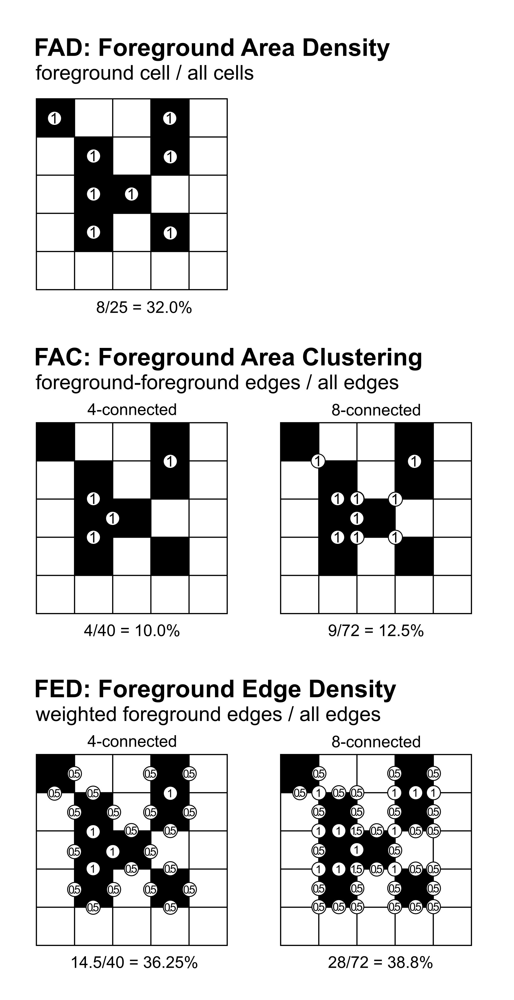

Fragmentation
=============

Fragmentation analysis uses a Fixed Observation Scale (FOS) approach to compute
foreground pattern indices within a user-defined moving window. Each foreground
pixel is assigned a value based on the local neighbourhood composition, providing
a spatially explicit measure of landscape fragmentation.

Two methods are available:

- **FAD** (Foreground Area Density): computes within each window the proportion
  of foreground pixels relative to the total number of window pixels.
- **FAC** (Foreground Area Clustering): computes within each window the proportion
  of common adjacencies (shared vertical or horizontal pixel edges) between
  foreground pixels relative to the total number of adjacencies inside the
  moving window.

Further details about Fragmentation analysis are available in the
`Connectivity/Fragmentation product sheet
<https://ies-ows.jrc.ec.europa.eu/gtb/GTB/psheets/GTB-Fragmentation-FADFOS.pdf>`_.

    Comparison of FAD and FAC methods exemplified for a 5x5 moving window 
    on a binary input map where black pixels are the foreground.

Fragmentation Classes
---------------------

The result of a FOS analysis is a map with the same spatial extent as the input,
where each foreground pixel receives a value in the range [0, 100] reflecting the
FAD or FAC metric in its local neighbourhood. These continuous values are then
grouped into 5 classes and colour-coded in the output map:

.. list-table::
   :header-rows: 1

   * - Foreground cover class
     - FOS range
     - Fragmentation
     - Connectivity
   * - **Rare**
     - 0 -- 10%
     - Very low
     - Very high
   * - **Patchy**
     - 10 -- 40%
     - Low 
     - High
   * - **Transitional**
     - 40 -- 60%
     - Medium 
     - Medium
   * - **Dominant**
     - 60 -- 90%
     - High 
     - Low
   * - **Interior**
     - 90 -- 100%
     - Very high 
     - Very low

Usage
-----

.. code-block:: python

    import pyguidos as pg

    result = pg.frag(
        in_tiff="my_map.tif",
        method="FAD",
        window_size=27,
        outdir="output/",
        statists=True,
        stat_files=True,
        verb=False
    )

Parameters
----------

.. list-table::
   :header-rows: 1

   * - Parameter
     - Type
     - Default
     - Description
   * - ``in_tiff``
     - str or Path
     - --
     - Path to input GeoTIFF
   * - ``method``
     - str
     - --
     - Fragmentation method: ``'FAD'`` or ``'FOS'``
   * - ``window_size``
     - int
     - --
     - Moving window size in pixels, odd integer >= 3
   * - ``outdir``
     - str or Path
     - None
     - Output directory
   * - ``statists``
     - bool
     - True
     - Compute statistics
   * - ``stat_files``
     - bool
     - True
     - Write statistics to files
   * - ``verb``
     - bool
     - False
     - Print progress messages

Output Files
------------

.. list-table::
   :header-rows: 1

   * - File
     - Description
   * - ``<name>_<method>_<window_size>.tif``
     - Fragmentation result GeoTIFF with colour palette
   * - ``<name>_<method>_<window_size>.txt``
     - Statistics report
   * - ``<name>_<method>_<window_size>.csv``
     - Per-value pixel counts and frequencies
   * - ``<name>_<method>_<window_size>.png``
     - Foreground pixel histogram

Results
-------

The :func:`frag` function returns a :class:`dict`. The structure is nested as follows:

* **output paths** (:class:`dict` or :obj:`None`)
    * **path tif** (:class:`str`): Absolute path to the fragmentation result GeoTIFF.
    * **path txt** (:class:`str`): Absolute path to the statistics text report.
    * **path csv** (:class:`str`): Absolute path to the per-value pixel count CSV.
    * **path png** (:class:`str`): Absolute path to the foreground pixel histogram image.
    * *Note: This key is* ``None`` *if* ``stat_files=False``.

* **input stats** (:class:`dict`)
    * **foreground pxl** (:class:`int`): Count of pixels with value 2 (Forest).
    * **background pxl** (:class:`int`): Count of pixels with value 1 (Background).
    * **missing pxl** (:class:`int`): Count of NoData (0) pixels.
    * **backgr3 pxl** (:class:`int`): Count of special background class 3 pixels.
    * **backgr4 pxl** (:class:`int`): Count of special background class 4 pixels.

* **output stats** (:class:`dict`)
    * **class freq** (:class:`dict`): Breakdown of pixel counts per fragmentation category:
        * ``1 rare pxl``: Pixels in the "Rare" category.
        * ``2 patch pxl``: Pixels in the "Patchy" category.
        * ``3 trans pxl``: Pixels in the "Transitional" category.
        * ``4 domin pxl``: Pixels in the "Dominant" category.
        * ``5 inter pxl``: Pixels in the "Interior" category.
    * **fad_av** (:class:`float`): The average Forest Area Density index.
    * **avcon** (:class:`float`): The Average Connectivity index.

.. code-block:: python

    result = pg.frag("my_map.tif", method="FAD", window_size=27)

    # Access statistics
    print(result.keys())
    # dict_keys(['output paths', 'input stats', 'output stats'])

    # Input pixel counts
    print(result["input stats"])
    # {'foreground pxl': 12500, 'background pxl': 37500, 'missing pxl': 0, ...}

    # Fragmentation indices and class pixel counts
    print(result["output stats"])
    # {{'1 rare pxl': 1200, '2 patch pxl': 2300, '3 trans pxl': 3100,
    #  '4 domin pxl': 4200, '5 inter pxl': 1700}, 'fad_av': 62.3, 'avcon': 58.1}

    # Output file paths
    print(result["output paths"])
    # {'path tif': 'output/my_map_fad_27.tif',
    #  'path txt': 'output/my_map_fad_27.txt',
    #  'path csv': 'output/my_map_fad_27.csv',
    #  'path png': 'output/my_map_fad_27.png'}

Computing Statistics Separately
--------------------------------

If you already have a fragmentation output GeoTIFF, you can compute
statistics without rerunning the analysis:

.. code-block:: python

    stats = pg.frag_stats(
        frag_tiff="output/my_map_fad_27.tif",
        stat_files=True,
        outdir="output/",
        source_tiff="my_map.tif"
    )

.. note::
    :func:`frag_stats` requires the input GeoTIFF to be an pyGuidos (or
    GTB) output raster file. See :doc:`input_format` for details.

