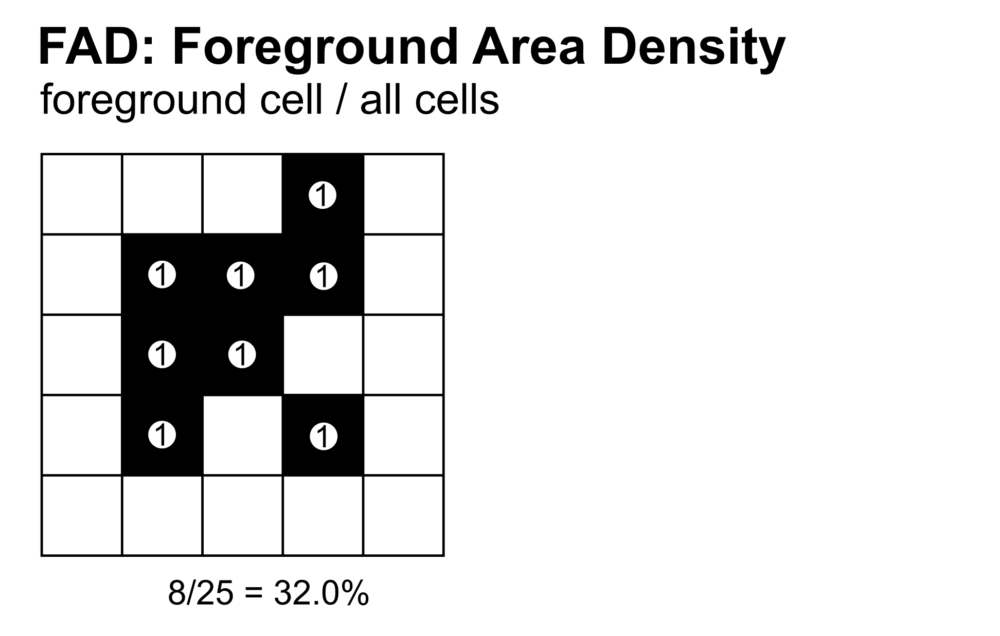
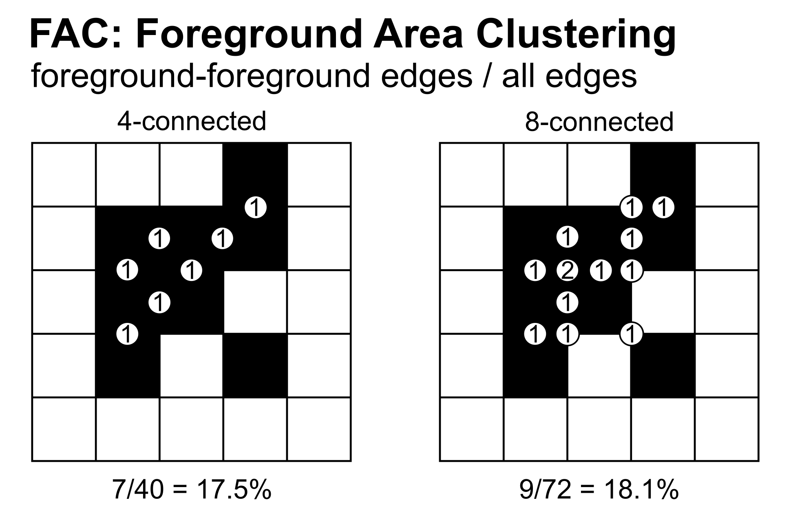
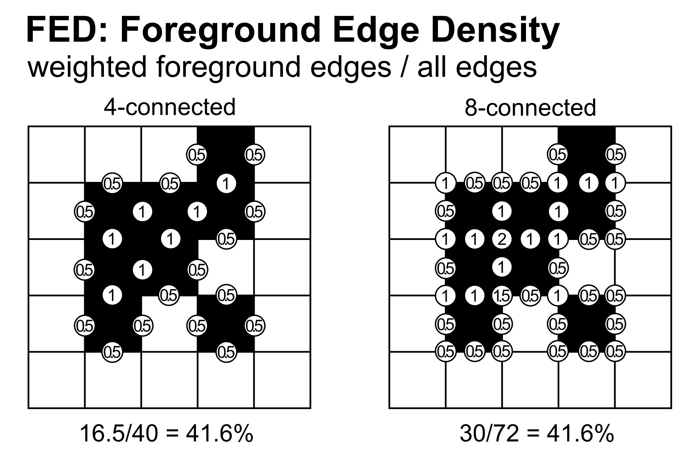

Fragmentation
=============

Fragmentation analysis uses a Fixed Observation Scale (FOS) approach to compute
foreground pattern indices within a user-defined moving window. Each foreground
pixel is assigned a value based on the local neighbourhood composition, providing
a spatially explicit measure of landscape fragmentation.

Three methods are available:

- **FAD** (Foreground Area Density): proportion of foreground pixels relative to
  the total number of window pixels.
- **FAC** (Foreground Area Clustering): proportion of foreground–foreground
  adjacencies relative to all adjacencies. Supports 4- and 8-connectivity.
- **FED** (Foreground Edge Density): weighted edge density where FG-FG pairs
  score 1.0, FG-BG pairs score 0.5, and BG-BG pairs score 0.0. Supports
  4- and 8-connectivity.

Further details about Fragmentation analysis are available in the
`Connectivity/Fragmentation product sheet
<https://ies-ows.jrc.ec.europa.eu/gtb/GTB/psheets/GTB-Fragmentation-FADFOS.pdf>`_.

FAD: Foreground Area Density
----------------------------

FAD computes the proportion of foreground pixels within the moving window
relative to the total number of pixels in the window. It provides a direct
measure of how much foreground (e.g., forest) is present in the local
neighbourhood of each pixel. The denominator is always the total window area
(W²), making FAD a pure area-based metric independent of pixel arrangement.

.. math::

   FAD = \frac{\text{number of foreground pixels in window}}{W^2} \times 100

    FAD computation example on a 5×5 binary input map (black = foreground).
    The window contains 25 pixels of which 13 are foreground. Each foreground
    pixel contributes 1 to the numerator (shown as value "1" in the circles).

FAC: Foreground Area Clustering
-------------------------------

FAC computes the proportion of foreground–foreground adjacencies within the
moving window relative to the total number of pixel pair adjacencies. Unlike
FAD, which only measures the amount of foreground, FAC captures how spatially
clustered the foreground pixels are — two windows with the same FAD value can
have very different FAC values depending on whether the foreground pixels are
grouped together or dispersed.

For 4-connectivity, only horizontal and vertical pixel pairs are considered.
For 8-connectivity, diagonal pairs are added. Each pair scores 1 if both pixels
are foreground, and 0 otherwise.

.. math::

   FAC = \frac{\text{foreground–foreground adjacencies}}{\text{total adjacencies in window}} \times 100

The total adjacencies (denominator) depend on connectivity:

- 4-connected: :math:`2 \times W \times (W-1)`
- 8-connected: :math:`2 \times (W-1) \times (2W-1)`

For a 5×5 window: 40 pairs (4-conn) or 72 pairs (8-conn).

    FAC computation example on a 5×5 binary input map for both 4- and
    8-connectivity. Each circle at a pixel boundary represents an adjacent pair.
    A pair scores 1 if both pixels are foreground (FG-FG), and 0 otherwise.

FED: Foreground Edge Density
----------------------------

FED computes a weighted measure of foreground involvement in pixel adjacencies.
It assigns a partial score to edges where foreground interacts with background,
providing a metric that is sensitive to the boundary between foreground and
non-foreground areas. The scoring for each pixel pair is:

- Foreground–Foreground: 1.0
- Foreground–Background: 0.5
- Background–Background: 0.0

.. math::

   FED = \frac{\text{weighted foreground edges}}{\text{total edges in window}} \times 100

Like FAC, FED supports both 4- and 8-connectivity with the same denominator
formula.

    FED computation example on a 5×5 binary input map for both 4- and
    8-connectivity. Each circle shows the weighted score: 1 for FG-FG pairs,
    0.5 for FG-BG pairs, and 0 (not shown) for BG-BG pairs. In 8-connected
    mode, junction points show the sum of both diagonal pairs crossing through
    them (possible values: 0.5, 1, 1.5, or 2).

Fragmentation Classes
---------------------

The result of a FOS analysis is a map with the same spatial extent as the input,
where each foreground pixel receives a value in the range [0, 100] reflecting the
FAD or FAC metric in its local neighbourhood. These continuous values are then
grouped into 5 classes and colour-coded in the output map:

.. list-table::
   :header-rows: 1

   * - Foreground cover class
     - FOS range
     - Fragmentation
     - Connectivity
   * - **Rare**
     - 0 -- 10%
     - Very low
     - Very high
   * - **Patchy**
     - 10 -- 40%
     - Low 
     - High
   * - **Transitional**
     - 40 -- 60%
     - Medium 
     - Medium
   * - **Dominant**
     - 60 -- 90%
     - High 
     - Low
   * - **Interior**
     - 90 -- 100%
     - Very high 
     - Very low

Usage
-----

.. code-block:: python

    import pyguidos as pg

    # FAD - Foreground Area Density
    result = pg.frag(
        in_tiff="my_map.tif",
        method="FAD",
        window_size=27,
        outdir="output/",
        statists=True,
        stat_files=True,
        verb=False
    )

    # FAC - Foreground Area Clustering (8-connected)
    result = pg.frag(
        in_tiff="my_map.tif",
        method="FAC",
        window_size=27,
        connectivity=8
    )

    # FED - Foreground Edge Density (4-connected)
    result = pg.frag(
        in_tiff="my_map.tif",
        method="FED",
        window_size=27,
        connectivity=4
    )

Parameters
----------

.. list-table::
   :header-rows: 1

   * - Parameter
     - Type
     - Default
     - Description
   * - ``in_tiff``
     - str or Path
     - --
     - Path to input GeoTIFF
   * - ``method``
     - str
     - --
     - Fragmentation method: ``'FAD'``, ``'FAC'``, or ``'FED'``
   * - ``window_size``
     - int
     - --
     - Moving window size in pixels, odd integer >= 3
   * - ``connectivity``
     - int
     - 4
     - Pixel connectivity for FAC and FED: 4 or 8. Ignored for FAD.
   * - ``outdir``
     - str or Path
     - None
     - Output directory
   * - ``statists``
     - bool
     - True
     - Compute statistics
   * - ``stat_files``
     - bool
     - True
     - Write statistics to files
   * - ``verb``
     - bool
     - False
     - Print progress messages

Output Files
------------

.. list-table::
   :header-rows: 1

   * - File
     - Description
   * - ``<name>_<method>_<window_size>.tif``
     - Fragmentation result GeoTIFF with colour palette
   * - ``<name>_<method>_<window_size>.txt``
     - Statistics report
   * - ``<name>_<method>_<window_size>.csv``
     - Per-value pixel counts and frequencies
   * - ``<name>_<method>_<window_size>.png``
     - Foreground pixel histogram

Results
-------

The :func:`frag` function returns a :class:`dict`. The structure is nested as follows:

* **output paths** (:class:`dict` or :obj:`None`)
    * **path tif** (:class:`str`): Absolute path to the fragmentation result GeoTIFF.
    * **path txt** (:class:`str`): Absolute path to the statistics text report.
    * **path csv** (:class:`str`): Absolute path to the per-value pixel count CSV.
    * **path png** (:class:`str`): Absolute path to the foreground pixel histogram image.
    * *Note: This key is* ``None`` *if* ``stat_files=False``.

* **input stats** (:class:`dict`)
    * **foreground pxl** (:class:`int`): Count of pixels with value 2 (Forest).
    * **background pxl** (:class:`int`): Count of pixels with value 1 (Background).
    * **missing pxl** (:class:`int`): Count of NoData (0) pixels.
    * **backgr3 pxl** (:class:`int`): Count of special background class 3 pixels.
    * **backgr4 pxl** (:class:`int`): Count of special background class 4 pixels.

* **output stats** (:class:`dict`)
    * **class freq** (:class:`dict`): Breakdown of pixel counts per fragmentation category:
        * ``1 rare pxl``: Pixels in the "Rare" category.
        * ``2 patch pxl``: Pixels in the "Patchy" category.
        * ``3 trans pxl``: Pixels in the "Transitional" category.
        * ``4 domin pxl``: Pixels in the "Dominant" category.
        * ``5 inter pxl``: Pixels in the "Interior" category.
    * **fad_av** (:class:`float`): The average Forest Area Density index.
    * **avcon** (:class:`float`): The Average Connectivity index.

.. code-block:: python

    result = pg.frag("my_map.tif", method="FAD", window_size=27)

    # Access statistics
    print(result.keys())
    # dict_keys(['output paths', 'input stats', 'output stats'])

    # Input pixel counts
    print(result["input stats"])
    # {'foreground pxl': 12500, 'background pxl': 37500, 'missing pxl': 0, ...}

    # Fragmentation indices and class pixel counts
    print(result["output stats"])
    # {{'1 rare pxl': 1200, '2 patch pxl': 2300, '3 trans pxl': 3100,
    #  '4 domin pxl': 4200, '5 inter pxl': 1700}, 'fad_av': 62.3, 'avcon': 58.1}

    # Output file paths
    print(result["output paths"])
    # {'path tif': 'output/my_map_frag_fad_27.tif',
    #  'path txt': 'output/my_map_frag_fad_27.txt',
    #  'path csv': 'output/my_map_frag_fad_27.csv',
    #  'path png': 'output/my_map_frag_fad_27.png'}

Computing Statistics Separately
--------------------------------

If you already have a fragmentation output GeoTIFF, you can compute
statistics without rerunning the analysis:

.. code-block:: python

    stats = pg.frag_stats(
        frag_tiff="output/my_map_frag_fad_27.tif",
        stat_files=True,
        outdir="output/",
        source_tiff="my_map.tif"
    )

.. note::
    :func:`frag_stats` requires the input GeoTIFF to be an pyGuidos (or
    GTB) output raster file. See :doc:`input_format` for details.

