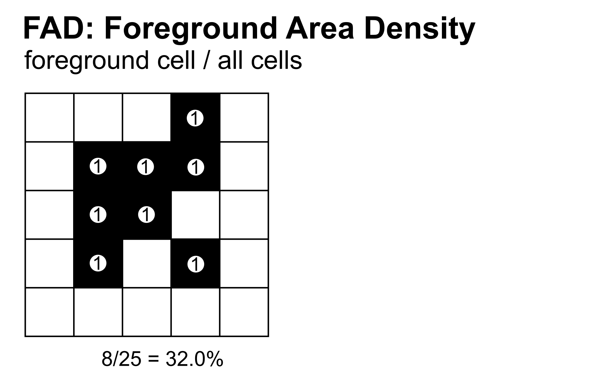
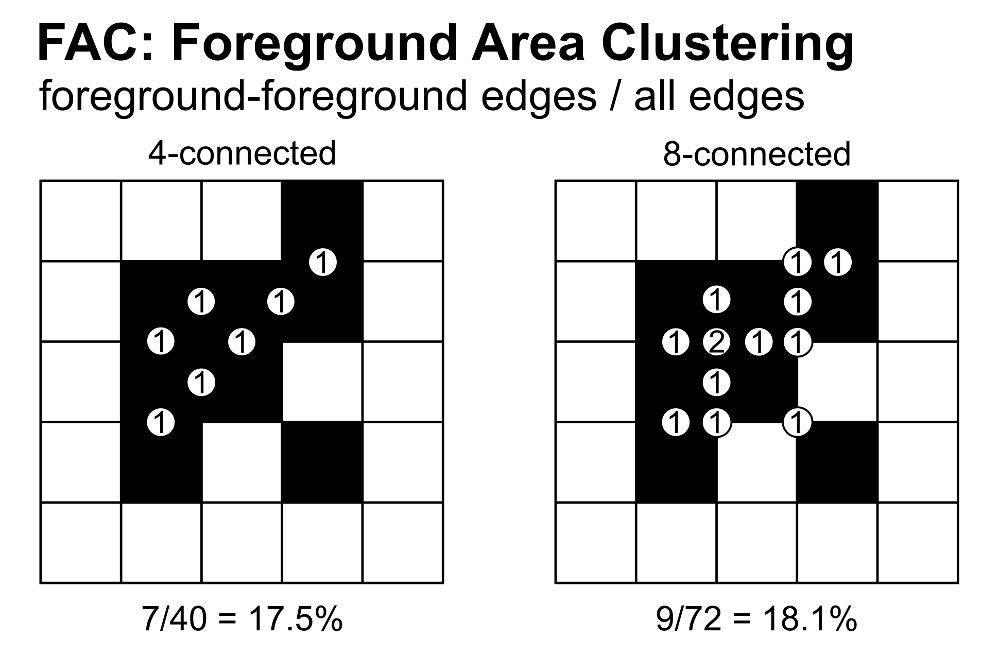
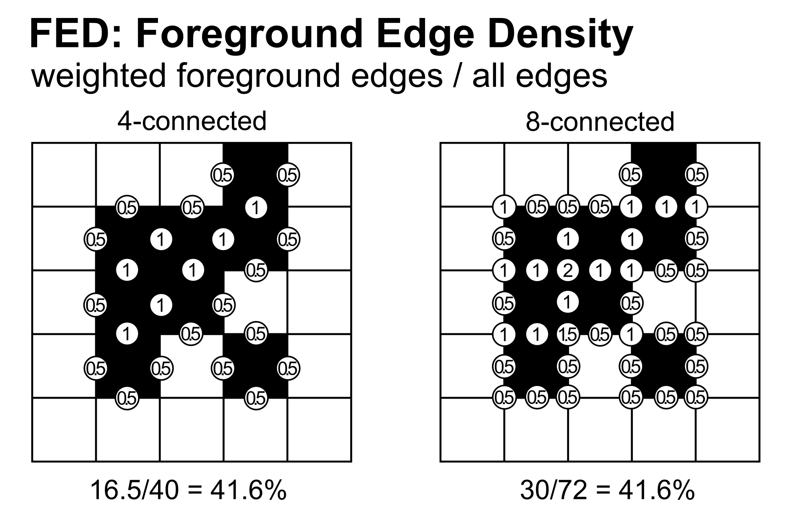

Fragmentation
=============

Fragmentation analysis uses a Fixed Observation Scale (FOS) approach to compute
foreground pattern indices within a user-defined moving window, which is a
square neighbourhood of W × W pixels that is centred on each foreground pixel
in the raster, one at a time.
The window size W defines the side length of this square and must be an odd integer
(e.g., 3, 5, 27) so that the centre pixel is unambiguously defined. As the window
moves across the map, the fragmentation index is computed from all pixels within
the window and assigned to the centre pixel. Larger windows capture broader
landscape context but smooth local detail; smaller windows preserve fine-grained
spatial patterns but are more sensitive to local noise. The choice of W
determines the Fixed Observation Scale (FOS) at which fragmentation is measured.

To compute the foreground fragmentation, three methods are available:

- **FAD** (Foreground Area Density): proportion of foreground pixels relative to
  the total number of window pixels.
- **FAC** (Foreground Area Clustering): proportion of foreground–foreground
  adjacencies relative to all adjacencies. Supports 4- and 8-connectivity.
- **FED** (Foreground Edge Density): weighted edge density where FG-FG pairs
  score 1.0, FG-BG pairs score 0.5, and BG-BG pairs score 0.0. Supports
  4- and 8-connectivity.

Further details about Fragmentation analysis are available in the
`Connectivity/Fragmentation product sheet
<https://ies-ows.jrc.ec.europa.eu/gtb/GTB/psheets/GTB-Fragmentation-FADFOS.pdf>`_.

Functions
---------

.. py:function:: pyguidos.frag(in_tiff, method, window_size, connectivity=4, outdir=None, statists=True, stat_files=True, verb=False)

   Performs Fragmentation analysis on a binary raster, computing the
   proportion of foreground pixels within each moving window [0-100] and
   classifying landscape fragmentation into five classes: Rare, Patchy,
   Transitional, Dominant and Interior.

   :param in_tiff: Path to input GeoTIFF (0=NoData, 1=Background, 2=Foreground; optionally 3/4 for special background classes).
   :type in_tiff: str or Path
   :param method: Fragmentation method: ``'FAD'`` (Foreground Area Density), ``'FAC'`` (Foreground Area Clustering) or ``'FED'`` (Foreground Edge Density).
   :type method: str
   :param window_size: Size of the moving window in pixels. Must be an odd integer >= 3.
   :type window_size: int
   :param connectivity: Pixel connectivity for FAC and FED methods, 4 or 8. Ignored for FAD.
   :type connectivity: int, optional
   :param outdir: Output directory. If ``None`` (default), outputs are written to the input file's directory.
   :type outdir: str or Path, optional
   :param statists: If ``True``, computes and returns statistics.
   :type statists: bool, optional
   :param stat_files: If ``True``, writes .txt, .csv and .png report files.
   :type stat_files: bool, optional
   :param verb: If ``True``, prints progress messages.
   :type verb: bool, optional

   :returns: **dict** -- A dictionary containing three main sections:

       * ``"output paths"`` (*dict* or *None*):
           * ``"path tif"`` (*str*) -- Absolute path to the result GeoTIFF.
           * ``"path txt"`` (*str*) -- Absolute path to the statistics report.
           * ``"path csv"`` (*str*) -- Absolute path to the per-value pixel count CSV.
           * ``"path png"`` (*str*) -- Absolute path to the foreground pixel histogram.
       * ``"input stats"`` (*dict*):
           * ``"foreground pxl"`` (*int*) -- Count of foreground pixels.
           * ``"background pxl"`` (*int*) -- Count of background pixels.
           * ``"missing pxl"`` (*int*) -- Count of NoData pixels.
           * ``"backgr3 pxl"`` (*int*) -- Count of special background class 3 pixels.
           * ``"backgr4 pxl"`` (*int*) -- Count of special background class 4 pixels.
       * ``"output stats"`` (*dict*):
           * ``"class freq"`` (*dict*) -- Pixel counts per fragmentation class (``"1 rare pxl"``, ``"2 patch pxl"``, ``"3 trans pxl"``, ``"4 domin pxl"``, ``"5 inter pxl"``).
           * ``"fad_av"`` (*float*) -- Average Foreground Area Density index.
           * ``"avcon"`` (*float*) -- Average Connectivity index.

   :outputs: The function writes the following output files with ``stat_files=True``:

       * ``<input_filename>_frag_<method><connectivity>_<window_size>.tif``: Fragmentation result GeoTIFF with color palette (connectivity is omitted for FAD).
       * ``<input_filename>_frag_<method><connectivity>_<window_size>.txt``: Statistics report
       * ``<input_filename>_frag_<method><connectivity>_<window_size>.csv``: Per-value pixel counts and frequencies
       * ``<input_filename>_frag_<method><connectivity>_<window_size>.png``: Foreground pixel histogram

   .. rubric:: Example
   Standard execution of a FAD Fragmentation analysis using the Forest/Non-Forest
   GeoTIFF file of Corsica stored in the ``pyguidos/data`` folder:

   .. code-block:: python

        >>> import pyguidos as pg
        >>> forest_map = pg.DATA_DIR / "CLC2018_corsica_FNF.tif"
        >>> frag_result = pg.frag(in_tiff=forest_map, method="FAD", window_size=27,
        ... outdir="output/", statists=True, stat_files=True, verb=False)
        >>> frag_result['output stats']['avcon']
        22.755996751175065
        >>> frag_result['output paths']['path tif']
        'output/CLC2018_corsica_FNF_frag_fad_27.tif'

.. py:function:: pyguidos.frag_stats(frag_tiff, stat_files=True, outdir=None, source_tiff=None)

   Computes statistics for an existing (binary) Fragmentation result GeoTIFF.

   :param frag_tiff: Path to the fragmentation result GeoTIFF (must carry a valid ``GTB_FOS`` metadata tag).
   :type frag_tiff: str or Path
   :param stat_files: If ``True``, writes .txt, .csv and .png report files.
   :type stat_files: bool, optional
   :param outdir: Directory for output files. Defaults to the input file's directory.
   :type outdir: str or Path, optional
   :param source_tiff: Path to the original input GeoTIFF used to generate the fragmentation result.
   :type source_tiff: str or Path, optional

   :returns: **dict** -- A dictionary containing three main sections:

       * ``"output paths"`` (*dict* or *None*):
           * ``"path tif"`` (*str*) -- Absolute path to the result GeoTIFF.
           * ``"path txt"`` (*str*) -- Absolute path to the statistics report.
           * ``"path csv"`` (*str*) -- Absolute path to the per-value pixel count CSV.
           * ``"path png"`` (*str*) -- Absolute path to the foreground pixel histogram.
       * ``"input stats"`` (*dict*):
           * ``"foreground pxl"`` (*int*) -- Count of foreground pixels.
           * ``"background pxl"`` (*int*) -- Count of background pixels.
           * ``"missing pxl"`` (*int*) -- Count of NoData pixels.
           * ``"backgr3 pxl"`` (*int*) -- Count of special background class 3 pixels.
           * ``"backgr4 pxl"`` (*int*) -- Count of special background class 4 pixels.
       * ``"output stats"`` (*dict*):
           * ``"class freq"`` (*dict*) -- Pixel counts per fragmentation class (``"1 rare pxl"``, ``"2 patch pxl"``, ``"3 trans pxl"``, ``"4 domin pxl"``, ``"5 inter pxl"``).
           * ``"fad_av"`` (*float*) -- Average Foreground Area Density index.
           * ``"avcon"`` (*float*) -- Average Connectivity index.

   :outputs: The function writes the following output files with ``stat_files=True``:

       * ``<frag_filename>.txt``: Statistics report
       * ``<frag_filename>.csv``: Per-value pixel counts and frequencies
       * ``<frag_filename>.png``: Foreground pixel histogram

   .. rubric:: Example
   After executing the Fragmentation analysis, pass the resulting GeoTIFF to
   ``frag_stats()`` to extract summary statistics.

   .. code-block:: python

        >>> frag_tiff = 'output/CLC2018_corsica_FNF_frag_fad_27.tif'
        >>> frag_stats = pg.frag_stats(frag_tiff=frag_tiff, stat_files=True,
        ... outdir='output/', source_tiff=None)
        >>> frag_stats['input stats']['foreground pxl']
        300737

Methods
-------

FAD: Foreground Area Density
^^^^^^^^^^^^^^^^^^^^^^^^^^^^^

FAD computes the proportion of foreground pixels within the moving window
relative to the total number of pixels in the window. It provides a direct
measure of how much foreground (e.g., forest) is present in the local
neighbourhood of each pixel. The denominator is always the total window area
(W²), making FAD a pure area-based metric independent of pixel arrangement.

.. math::

   FAD = \frac{\text{number of foreground pixels}}{\text{total pixels}} \times 100

    FAD computation example on a 5×5 binary input map (black = foreground).
    The window contains 25 pixels of which 13 are foreground. Each foreground
    pixel contributes 1 to the numerator (shown as value "1" in the circles).

FAC: Foreground Area Clustering
^^^^^^^^^^^^^^^^^^^^^^^^^^^^^^^^

FAC computes the proportion of foreground–foreground edges within the
moving window relative to the total number of pixel pair edges. Unlike
FAD, which only measures the amount of foreground, FAC captures how spatially
clustered the foreground pixels are — two windows with the same FAD value can
have very different FAC values depending on whether the foreground pixels are
grouped together or dispersed.

For 4-connectivity, only horizontal and vertical pixel pairs are considered.
For 8-connectivity, diagonal pairs are added. Each pair scores 1 if both pixels
are foreground, and 0 otherwise.

.. math::

   FAC = \frac{\text{foreground–foreground edges}}{\text{total edges}} \times 100

The total edges (denominator) depend on window size (W) supporting both 4- and
8-connectivity:

- Total edges 4-conn. = :math:`2 \times W \times (W-1)`
- Total edges 8-conn. = :math:`2 \times (W-1) \times (2W-1)`

    FAC computation example on a 5×5 binary input map for both 4- and
    8-connectivity. Each circle at a pixel boundary represents an edge pair.
    A pair scores 1 if both pixels are foreground (FG-FG), and 0 otherwise.

FED: Foreground Edge Density
^^^^^^^^^^^^^^^^^^^^^^^^^^^^^

FED computes a weighted measure of foreground involvement in pixel edges.
It assigns a partial score to edges where foreground interacts with background,
providing a metric that is sensitive to the boundary between foreground and
non-foreground areas. The scoring for each pixel pair is:

- Foreground–Foreground: 1.0
- Foreground–Background: 0.5
- Background–Background: 0.0

.. math::

   FED = \frac{\text{weighted foreground edges}}{\text{total edges}} \times 100

As FAC, the total edges (denominator) depend on window size (W) supporting both 4- and
8-connectivity:

- Total edges 4-conn. = :math:`2 \times W \times (W-1)`
- Total edges 8-conn. = :math:`2 \times (W-1) \times (2W-1)`

    FED computation example on a 5×5 binary input map for both 4- and
    8-connectivity. Each circle shows the weighted score: 1 for FG-FG pairs,
    0.5 for FG-BG pairs, and 0 (not shown) for BG-BG pairs. In 8-connected
    mode, junction points show the sum of both diagonal pairs crossing through
    them (possible values: 0.5, 1, 1.5, or 2).

Output Classes
--------------

The result of a FOS analysis is a map with the same spatial extent as the input,
where each foreground pixel receives a value in the range [0, 100] reflecting the
FAD or FAC metric in its local neighbourhood. These continuous values are then
grouped into 5 classes and colour-coded in the output map:

.. list-table::
   :header-rows: 1

   * - Foreground cover class
     - FOS range
     - Fragmentation
     - Connectivity
   * - **Rare**
     - 0 -- 10%
     - Very low
     - Very high
   * - **Patchy**
     - 10 -- 40%
     - Low
     - High
   * - **Transitional**
     - 40 -- 60%
     - Medium
     - Medium
   * - **Dominant**
     - 60 -- 90%
     - High
     - Low
   * - **Interior**
     - 90 -- 100%
     - Very high
     - Very low
