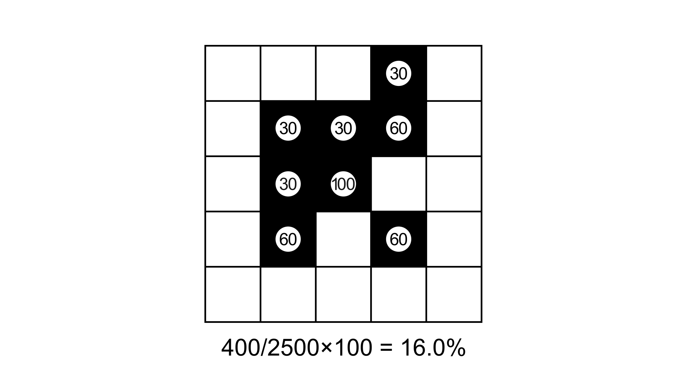
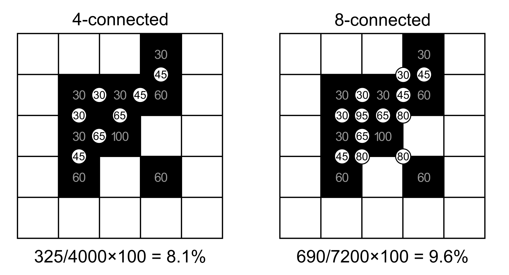
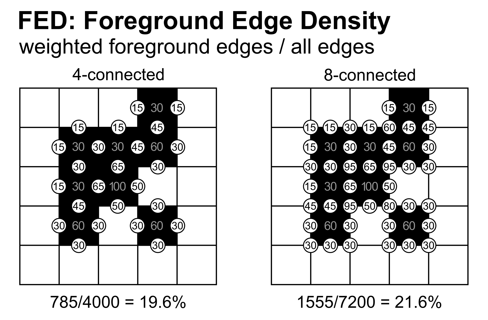

Fragmentation Grayscale
=======================

Grayscale Fragmentation extends the binary FOS approach to continuous-value
rasters where pixel values represent foreground intensity from 0 to 100
(e.g., tree cover density percentage). Instead of counting foreground pixels
as binary present/absent, the grayscale methods use the actual pixel intensity
values in the computations, providing a more nuanced assessment of landscape
connectivity.

The foreground threshold ``for_threshold`` defines the minimum pixel intensity 
required for a pixel to be classified as foreground and thus processed by the 
analysis. Pixels with values below this threshold are treated as non-foreground 
— they are not analysed themselves, but their actual values (including zero) 
still contribute to the computation within the moving windows of neighbouring 
foreground pixels. 
For example, with a tree cover density map and ``for_threshold=30``, only 
pixels with ≥30% canopy cover are considered "forest" and receive a 
fragmentation score, while pixels with 1–29% cover still influence the density 
and connectivity of adjacent forest pixels through their actual values. 
Setting ``for_threshold=1`` processes all non-zero pixels as foreground; higher 
thresholds allow the user to focus the analysis on denser canopy areas from the 
same input map without reclassification.

Three methods are available:

- **FAD** (Foreground Area Density): sum of pixel values in the window divided
  by the maximum possible sum (all pixels at 100).
- **FAC** (Foreground Area Clustering): average of pixel pair values where both
  pixels are foreground, divided by the maximum possible.
- **FED** (Foreground Edge Density): average of pixel pair values for any pair
  involving at least one foreground pixel, divided by the maximum possible.

Input conventions:

- **0** = Background
- **1–100** = Foreground intensity (percentage)
- **>100** = NoData (any value above 100 is treated as missing)

FAD: Foreground Area Density (grayscale)
----------------------------------------

Grayscale FAD computes the sum of all pixel values in the window of size W 
divided by the maximum potential, where all pixels within the windows have 
a value of 100 (W² × 100). 

.. math::

   FAD_{gray} = \frac{\sum_{i \in window} v_i}{W^2 \times 100} \times 100

Where :math:`v_i` is the pixel value, and :math:`W` is the window size. The 
denominator scales by 100 because the maximum possible pixel value is 100.

    Grayscale FAD computation on a 5×5 window. Grey pixel values represent
    foreground intensity (0–100). Each pixel value contributes directly to the
    sum (shown in the circles). The result is the sum of all values divided by
    the maximum potential (5 × 5 × 100 = 2500).

FAC: Foreground Area Clustering (grayscale)
-------------------------------------------

Grayscale FAC computes the edge value as the average of two adjacent pixel
values, but only for pairs where **both** pixels are foreground (i.e., both
≥ 1). Pairs where one or both pixels are 0, the edge scores 0.

.. math::

   FAC_{gray} = \frac{\sum_{FG-FG pairs} \frac{a + b}{2} }{\text{total edges} \times 100} \times 100

Where :math:`a` and :math:`b` are the pixel values, and :math:`W` is the window size. 
The denominator scales by 100 because the maximum possible edge value is 100 
(when both pixels are at 100%).

- Total edges 4-conn. = :math:`2 \times W \times (W-1)`
- Total edges 8-conn. = :math:`2 \times (W-1) \times (2W-1)`

    Grayscale FAC computation on a 5×5 window for both 4- and 8-connectivity.
    Each circle shows the average of the two adjacent pixel values, but only
    for pairs where both pixels are foreground (≥ 1). Pairs involving
    non-foreground pixels score 0 and are not shown.

FED: Foreground Edge Density (grayscale)
----------------------------------------

Grayscale FED computes the edge value as the average of two adjacent pixel
values for **any** pair involving at least one foreground pixel. This means
foreground–background boundaries also contribute (with reduced weight
since background value is 0), while background–background pairs score 0.

.. math::

   FED_{gray} = \frac{\sum_{pairs} \frac{a + b}{2}}{\text{total edges} \times 100} \times 100

Where :math:`a` and :math:`b` are the pixel values, and :math:`W` is the window size. 
The denominator scales by 100 because the maximum possible edge value is 100 
(when both pixels are at 100%).

- Total edges 4-conn. = :math:`2 \times W \times (W-1)`
- Total edges 8-conn. = :math:`2 \times (W-1) \times (2W-1)`

    Grayscale FED computation on a 5×5 window for both 4- and 8-connectivity.
    Each circle shows the average of the two adjacent pixel values. Unlike FAC, 
    pairs where one pixel is foreground and the other is background also 
    contribute (with half the foreground value).

Fragmentation Classes
---------------------

The output classification follows the same 5-class scheme as binary fragmentation:

.. list-table::
   :header-rows: 1

   * - Foreground cover class
     - FOS range
     - Fragmentation
     - Connectivity
   * - **Rare**
     - 0 -- 10%
     - Very low
     - Very high
   * - **Patchy**
     - 10 -- 40%
     - Low
     - High
   * - **Transitional**
     - 40 -- 60%
     - Medium
     - Medium
   * - **Dominant**
     - 60 -- 90%
     - High
     - Low
   * - **Interior**
     - 90 -- 100%
     - Very high
     - Very low

Usage
-----

.. code-block:: python

    import pyguidos as pg

    # FAD grayscale (all tree cover)
    result = pg.frag_gray(
        in_tiff="tree_cover_density.tif",
        method="FAD",
        window_size=27,
        for_threshold=1,
        outdir="output/"
    )

    # FAC grayscale (only ≥30% canopy, 8-connected)
    result = pg.frag_gray(
        in_tiff="tree_cover_density.tif",
        method="FAC",
        window_size=27,
        for_threshold=30,
        connectivity=8
    )

    # FED grayscale
    result = pg.frag_gray(
        in_tiff="tree_cover_density.tif",
        method="FED",
        window_size=27,
        for_threshold=1,
        connectivity=4
    )

Parameters
----------

.. list-table::
   :header-rows: 1

   * - Parameter
     - Type
     - Default
     - Description
   * - ``in_tiff``
     - str or Path
     - --
     - Path to input GeoTIFF (uint8: 0=non-FG, 1-100=intensity, >100=NoData)
   * - ``method``
     - str
     - --
     - Fragmentation method: ``'FAD'``, ``'FAC'``, or ``'FED'``
   * - ``window_size``
     - int
     - --
     - Moving window size in pixels, odd integer >= 3
   * - ``for_threshold``
     - int
     - --
     - Foreground threshold (1–100). Pixels below are treated as background.
   * - ``connectivity``
     - int
     - 4
     - Pixel connectivity for FAC and FED: 4 or 8. Ignored for FAD.
   * - ``outdir``
     - str or Path
     - None
     - Output directory
   * - ``statists``
     - bool
     - True
     - Compute statistics
   * - ``stat_files``
     - bool
     - True
     - Write statistics to files
   * - ``verb``
     - bool
     - False
     - Print progress messages

Computing Statistics Separately
-------------------------------

If you already have a grayscale fragmentation output GeoTIFF, you can compute
statistics without rerunning the analysis:

.. code-block:: python

    stats = pg.frag_gray_stats(
        frag_tiff="output/tcd_frag_gray_fad_27.tif",
        stat_files=True,
        outdir="output/",
        source_tiff="tree_cover_density.tif"
    )

Providing ``source_tiff`` allows the function to report original input
foreground/background pixel counts. Without it, those values are shown as "n/a".

.. note::
    :func:`frag_gray_stats` requires the input GeoTIFF to be a pyGuidos
    grayscale fragmentation output (tag type ``Gray``). For binary fragmentation
    outputs, use :func:`frag_stats` instead.
