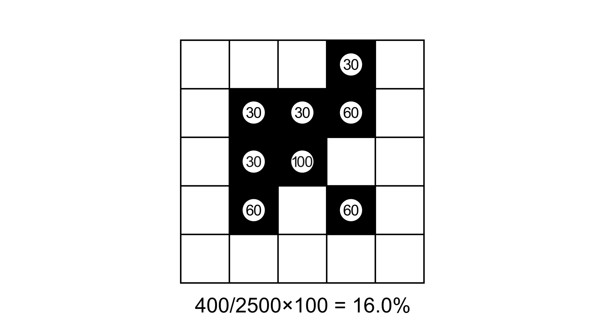
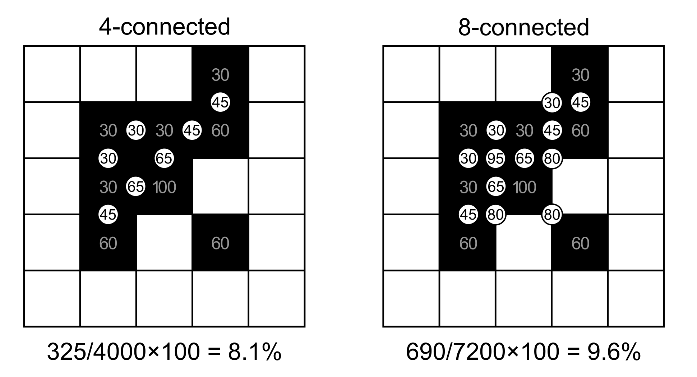
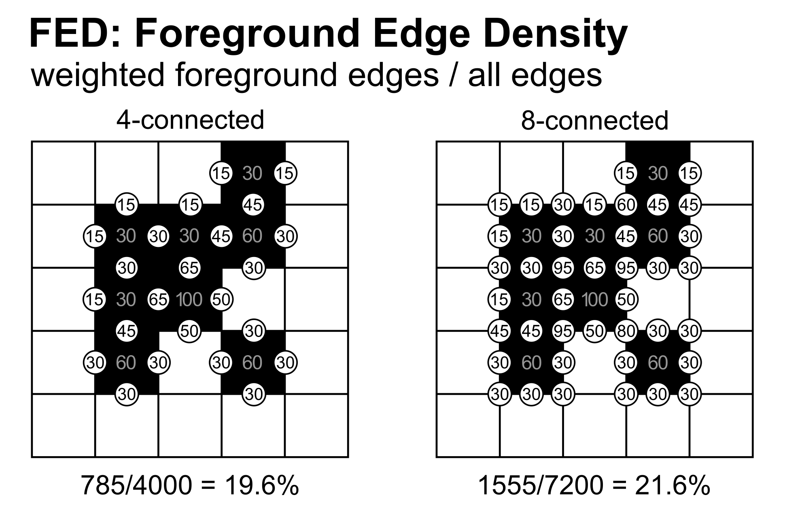

Fragmentation Grayscale
=======================

Grayscale Fragmentation extends the binary FOS approach to continuous-value
rasters where pixel values represent foreground intensity from 0 to 100
(e.g., tree cover density percentage). Instead of counting foreground pixels
as binary present/absent, the grayscale methods use the actual pixel intensity
values in the computations, providing a more nuanced assessment of landscape
connectivity.

The foreground threshold ``for_threshold`` defines the minimum pixel intensity
required for a pixel to be classified as foreground and thus processed by the
analysis. Pixels with values below this threshold are treated as non-foreground
— they are not analysed themselves, but their actual values (including zero)
still contribute to the computation within the moving windows of neighbouring
foreground pixels.
For example, with a tree cover density map and ``for_threshold=30``, only
pixels with ≥30% canopy cover are considered "forest" and receive a
fragmentation score, while pixels with 1–29% cover still influence the density
and connectivity of adjacent forest pixels through their actual values.
Setting ``for_threshold=1`` processes all non-zero pixels as foreground; higher
thresholds allow the user to focus the analysis on denser canopy areas from the
same input map without reclassification.

Three methods are available:

- **FAD** (Foreground Area Density): sum of pixel values in the window divided
  by the maximum possible sum (all pixels at 100).
- **FAC** (Foreground Area Clustering): average of pixel pair values where both
  pixels are foreground, divided by the maximum possible.
- **FED** (Foreground Edge Density): average of pixel pair values for any pair
  involving at least one foreground pixel, divided by the maximum possible.

Input conventions:

- **0** = Background
- **1–100** = Foreground intensity (percentage)
- **255** = NoData

Functions
---------

.. py:function:: pyguidos.frag_gray(in_tiff, method, window_size, for_threshold, connectivity=4, outdir=None, statists=True, stat_files=True, verb=False)

   Performs grayscale Fragmentation analysis on a continuous-value raster
   where pixel values represent foreground intensity from 0 to 100,
   classifying landscape fragmentation into five classes: Rare, Patchy,
   Transitional, Dominant and Interior.

   :param in_tiff: Path to input GeoTIFF (uint8: 0=Non-foreground, 1-100=Foreground intensity %, 255=NoData).
   :type in_tiff: str or Path
   :param method: Fragmentation method: ``'FAD'`` (Foreground Area Density), ``'FAC'`` (Foreground Area Clustering) or ``'FED'`` (Foreground Edge Density).
   :type method: str
   :param window_size: Size of the moving window in pixels. Must be an odd integer >= 3.
   :type window_size: int
   :param for_threshold: Foreground threshold value from 1 to 100. Pixels below this value are treated as non-foreground during computation.
   :type for_threshold: int
   :param connectivity: Pixel connectivity for FAC and FED methods, 4 or 8. Ignored for FAD.
   :type connectivity: int, optional
   :param outdir: Output directory. If ``None`` (default), outputs are written to the input file's directory.
   :type outdir: str or Path, optional
   :param statists: If ``True``, computes and returns statistics.
   :type statists: bool, optional
   :param stat_files: If ``True``, writes .txt, .csv and .png report files.
   :type stat_files: bool, optional
   :param verb: If ``True``, prints progress messages.
   :type verb: bool, optional

   :returns: **dict** -- A dictionary containing three main sections:

       * ``"output paths"`` (*dict* or *None*):
           * ``"path tif"`` (*str*) -- Absolute path to the result GeoTIFF.
           * ``"path txt"`` (*str*) -- Absolute path to the statistics report.
           * ``"path csv"`` (*str*) -- Absolute path to the per-value pixel count CSV.
           * ``"path png"`` (*str*) -- Absolute path to the foreground pixel histogram.
       * ``"input stats"`` (*dict*):
           * ``"in foreground pxl"`` (*int*) -- Input foreground pixel count (values 1-100, before thresholding).
           * ``"in background pxl"`` (*int*) -- Input background pixel count (value 0).
           * ``"out foreground pxl"`` (*int*) -- Output foreground pixel count (after thresholding).
           * ``"out background pxl"`` (*int*) -- Output background pixel count (after thresholding).
           * ``"missing pxl"`` (*int*) -- Count of NoData pixels.
       * ``"output stats"`` (*dict*):
           * ``"class freq"`` (*dict*) -- Pixel counts per fragmentation class (``"1 rare pxl"``, ``"2 patch pxl"``, ``"3 trans pxl"``, ``"4 domin pxl"``, ``"5 inter pxl"``).
           * ``"fad_av"`` (*float*) -- Average Foreground Area Density index.
           * ``"avcon"`` (*float*) -- Average Connectivity index.

   :outputs: The function writes the following output files with ``stat_files=True``:

       * ``<input_filename>_frag_gray_<method><connectivity>_<window_size>_t<for_threshold>.tif``: Grayscale fragmentation result GeoTIFF with color palette (connectivity is omitted for FAD).
       * ``<input_filename>_frag_gray_<method><connectivity>_<window_size>_t<for_threshold>.txt``: Statistics report
       * ``<input_filename>_frag_gray_<method><connectivity>_<window_size>_t<for_threshold>.csv``: Per-value pixel counts and frequencies
       * ``<input_filename>_frag_gray_<method><connectivity>_<window_size>_t<for_threshold>.png``: Foreground pixel histogram

   .. rubric:: Example
   Standard execution of a grayscale FAD Fragmentation analysis on a tree
   cover density raster, treating all non-zero pixels as foreground
   (``for_threshold=1``):

   .. code-block:: python

        >>> import pyguidos as pg
        >>> frag_result = pg.frag_gray(in_tiff="tree_cover_density.tif",
        ... method="FAD", window_size=27, for_threshold=1, outdir="output/",
        ... statists=True, stat_files=True, verb=False)
        >>> frag_result['output stats']['class freq']
        {'1 rare pxl': ..., '2 patch pxl': ..., '3 trans pxl': ...,
         '4 domin pxl': ..., '5 inter pxl': ...}
        >>> frag_result['output paths']['path tif']
        'output/tree_cover_density_frag_gray_fad_27_t1.tif'

.. py:function:: pyguidos.frag_gray_stats(frag_tiff, stat_files=True, outdir=None, source_tiff=None)

   Computes statistics for an existing grayscale Fragmentation result GeoTIFF.

   :param frag_tiff: Path to the grayscale fragmentation result GeoTIFF (must carry a valid ``GTB_FOS`` metadata tag with ``tiftype='Gray'``).
   :type frag_tiff: str or Path
   :param stat_files: If ``True``, writes .txt, .csv and .png report files.
   :type stat_files: bool, optional
   :param outdir: Directory for output files. Defaults to the input file's directory.
   :type outdir: str or Path, optional
   :param source_tiff: Path to the original input GeoTIFF used to generate the fragmentation result. When provided, the input foreground/background counts are reported; otherwise they are shown as ``"n/a"``.
   :type source_tiff: str or Path, optional

   :returns: **dict** -- A dictionary containing three main sections:

       * ``"output paths"`` (*dict* or *None*):
           * ``"path tif"`` (*str*) -- Absolute path to the result GeoTIFF.
           * ``"path txt"`` (*str*) -- Absolute path to the statistics report.
           * ``"path csv"`` (*str*) -- Absolute path to the per-value pixel count CSV.
           * ``"path png"`` (*str*) -- Absolute path to the foreground pixel histogram.
       * ``"input stats"`` (*dict*):
           * ``"in foreground pxl"`` (*int* or *str*) -- Input foreground pixel count, or ``"n/a"`` when ``source_tiff`` is not provided.
           * ``"in background pxl"`` (*int* or *str*) -- Input background pixel count, or ``"n/a"``.
           * ``"out foreground pxl"`` (*int*) -- Output foreground pixel count (after thresholding).
           * ``"out background pxl"`` (*int*) -- Output background pixel count (after thresholding).
           * ``"missing pxl"`` (*int*) -- Count of NoData pixels.
       * ``"output stats"`` (*dict*):
           * ``"class freq"`` (*dict*) -- Pixel counts per fragmentation class (``"1 rare pxl"``, ``"2 patch pxl"``, ``"3 trans pxl"``, ``"4 domin pxl"``, ``"5 inter pxl"``).
           * ``"fad_av"`` (*float*) -- Average Foreground Area Density index.
           * ``"avcon"`` (*float*) -- Average Connectivity index.

   :outputs: The function writes the following output files with ``stat_files=True``:

       * ``<frag_filename>.txt``: Statistics report
       * ``<frag_filename>.csv``: Per-value pixel counts and frequencies
       * ``<frag_filename>.png``: Foreground pixel histogram

   .. rubric:: Example
   After executing the grayscale Fragmentation analysis, pass the resulting
   GeoTIFF to ``frag_gray_stats()`` to extract summary statistics. Provide
   ``source_tiff`` to report the original input pixel counts.

   .. code-block:: python

        >>> frag_tiff = 'output/tree_cover_density_frag_gray_fad_27_t1.tif'
        >>> frag_stats = pg.frag_gray_stats(frag_tiff=frag_tiff,
        ... stat_files=True, outdir='output/',
        ... source_tiff="tree_cover_density.tif")
        >>> frag_stats['input stats']['out foreground pxl']
        301747

Methods
-------

FAD: Foreground Area Density (grayscale)
^^^^^^^^^^^^^^^^^^^^^^^^^^^^^^^^^^^^^^^^^

Grayscale FAD computes the sum of all pixel values in the window of size W
divided by the maximum potential, where all pixels within the windows have
a value of 100 (W² × 100).

.. math::

   FAD_{gray} = \frac{\sum \text{pixel values}}{W^2 \times 100} \times 100

Where :math:`a_i` is the pixel value, and :math:`W` is the window size. The
denominator scales by 100 because the maximum possible pixel value is 100.

    Grayscale FAD computation on a 5×5 window. Grey pixel values represent
    foreground intensity (0–100). Each pixel value contributes directly to the
    sum (shown in the circles). The result is the sum of all values divided by
    the maximum potential (5 × 5 × 100 = 2500).

FAC: Foreground Area Clustering (grayscale)
^^^^^^^^^^^^^^^^^^^^^^^^^^^^^^^^^^^^^^^^^^^^

Grayscale FAC computes the edge value as the average of two adjacent pixel
values, but only for pairs where **both** pixels are foreground (i.e., both
≥ 1). Pairs where one or both pixels are 0, the edge scores 0.

.. math::

   FAC_{gray} = \frac{\sum_{a>0,\, b>0} \frac{a + b}{2} }{\text{total edges} \times 100} \times 100

Where :math:`a` and :math:`b` are the pixel values of foreground-foreground pairs, so
:math:`a>0` and :math:`b>0`. The denominator scales by 100 because the maximum
possible edge value is 100 (when both pixels are at 100%).

- Total edges 4-conn. = :math:`2 \times W \times (W-1)`
- Total edges 8-conn. = :math:`2 \times (W-1) \times (2W-1)`

    Grayscale FAC computation on a 5×5 window for both 4- and 8-connectivity.
    Each circle shows the average of the two adjacent pixel values, but only
    for pairs where both pixels are foreground (≥ 1). Pairs involving
    non-foreground pixels score 0 and are not shown.

FED: Foreground Edge Density (grayscale)
^^^^^^^^^^^^^^^^^^^^^^^^^^^^^^^^^^^^^^^^^

Grayscale FED computes the edge value as the average of two adjacent pixel
values for **any** pair involving at least one foreground pixel. This means
foreground–background boundaries also contribute (with reduced weight
since background value is 0), while background–background pairs score 0.

.. math::

   FED_{gray} = \frac{\sum_{all} \frac{a + b}{2}}{\text{total edges} \times 100} \times 100

Where :math:`a` and :math:`b` are the pixel values of all pixel pairs.
The denominator scales by 100 because the maximum possible edge value
is 100 (when both pixels are at 100%).

- Total edges 4-conn. = :math:`2 \times W \times (W-1)`
- Total edges 8-conn. = :math:`2 \times (W-1) \times (2W-1)`

    Grayscale FED computation on a 5×5 window for both 4- and 8-connectivity.
    Each circle shows the average of the two adjacent pixel values. Unlike FAC,
    pairs where one pixel is foreground and the other is background also
    contribute (with half the foreground value).

Output Classes
--------------

The output classification follows the same 5-class scheme as binary fragmentation:

.. list-table::
   :header-rows: 1

   * - Foreground cover class
     - FOS range
     - Fragmentation
     - Connectivity
   * - **Rare**
     - 0 -- 10%
     - Very low
     - Very high
   * - **Patchy**
     - 10 -- 40%
     - Low
     - High
   * - **Transitional**
     - 40 -- 60%
     - Medium
     - Medium
   * - **Dominant**
     - 60 -- 90%
     - High
     - Low
   * - **Interior**
     - 90 -- 100%
     - Very high
     - Very low
