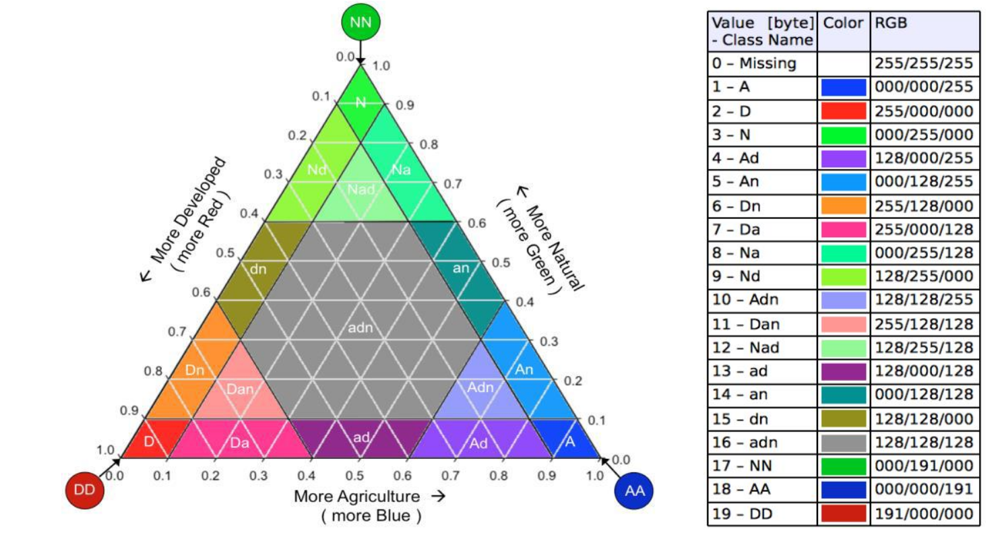

Landscape Mosaic
================

The Landscape Mosaic analysis classifies each pixel based on the
proportional composition of three land cover classes within a moving
window. The result describes the local landscape context of each pixel
in terms of the dominant land cover mixture, producing up to 103
compositional classes subsequently remapped to 19 aggregated classes.
The methodology is described in detail in the `Landscape Mosaic sheet 
<https://ies-ows.jrc.ec.europa.eu/gtb/GTB/psheets/GTB-Pattern-LM.pdf>`_.

Landscape Mosaic Classes
------------------------

The 19-class aggregation is based on the proportion of the three input
land cover classes within the moving window. By default, the three classes
are interpreted as:

.. list-table::
   :header-rows: 1
   :widths: 15 25 15

   * - Pixel Value
     - Default Interpretation
     - Color
   * - 1
     - Agriculture
     - Blue
   * - 2
     - Natural
     - Green
   * - 3
     - Developed
     - Red

.. note::
    The class assignment is purely conventional. Pixel values 1, 2 and 3
    can represent any three mutually exclusive land cover types defined
    by the user (e.g. Forest/Non-forest/Water, Urban/Rural/Natural).
    The labels Agriculture, Natural and Developed are used throughout
    this documentation for consistency with the GuidosToolbox convention,
    but the analysis is valid for any three-class input map.

    The Landscape Mosaic triangle with the 19 classes and their proportions 
    to the three land cover types Agriculture, Natural, and Developed.

Each of the 19 aggregated classes is defined by the combination of
proportions of the three input classes within the moving window:

.. list-table:: Landscape Mosaic 19-class aggregation scheme.
   :header-rows: 1

   * - N
     - Code
     - Description
     - AGR [%]
     - NAT [%]
     - DEV [%]
   * - 1
     - A
     - Agriculture dominant
     - [80-100[
     - [0-10[
     - [0-10[
   * - 2
     - D
     - Developed dominant
     - [0-10[
     - [0-10[
     - [80-100[
   * - 3
     - N
     - Natural dominant
     - [0-10[
     - [80-100[
     - [0-10[
   * - 4
     - Ad
     - Agriculture with Developed
     - [60-90[
     - [0-10[
     - [10-60[
   * - 5
     - An
     - Agriculture with Natural
     - [60-90[
     - [10-40[
     - [0-10[
   * - 6
     - Dn
     - Developed with Natural
     - [0-10[
     - [10-40[
     - [60-90[
   * - 7
     - Da
     - Developed with Agriculture
     - [10-40[
     - [0-10[
     - [60-90[
   * - 8
     - Na
     - Natural with Agriculture
     - [10-40[
     - [60-90[
     - [0-10[
   * - 9
     - Nd
     - Natural with Developed
     - [0-10[
     - [60-90[
     - [10-40[
   * - 10
     - Adn
     - Agriculture dominant mixed
     - [60-80[
     - [10-40[
     - [10-40[
   * - 11
     - Dan
     - Developed dominant mixed
     - [10-40[
     - [10-40[
     - [60-80[
   * - 12
     - Nad
     - Natural dominant mixed
     - [10-40[
     - [60-80[
     - [10-40[
   * - 13
     - ad
     - Agriculture-Developed transition
     - [30-60[
     - [0-10[
     - [30-60[
   * - 14
     - an
     - Agriculture-Natural transition
     - [30-60[
     - [30-60[
     - [0-10[
   * - 15
     - dn
     - Developed-Natural transition
     - [0-10[
     - [30-60[
     - [30-60[
   * - 16
     - adn
     - Mixed transition
     - [10-60[
     - [10-60[
     - [10-60[
   * - 17
     - NN
     - Pure Natural (100%)
     - [0]
     - [100]
     - [0]
   * - 18
     - AA
     - Pure Agriculture (100%)
     - [100]
     - [0]
     - [0]
   * - 19
     - DD
     - Pure Developed (100%)
     - [0]
     - [0]
     - [100]

Usage
-----

.. code-block:: python

    import pyguidos as pg

    result = pg.landmos(
        in_tiff="my_landcover.tif",
        window_size=31,
        outdir="output/",
        statists=True,
        stat_files=True,
        out_colors='bgr',
        verb=False
    )

Parameters
----------

.. list-table::
   :header-rows: 1

   * - Parameter
     - Type
     - Default
     - Description
   * - ``in_tiff``
     - str or Path
     - --
     - Path to input GeoTIFF
   * - ``window_size``
     - int
     - --
     - Moving window size in pixels, odd integer >= 3
   * - ``outdir``
     - str or Path
     - None
     - Output directory
   * - ``statists``
     - bool
     - True
     - Compute statistics
   * - ``stat_files``
     - bool
     - True
     - Write statistics to files
   * - ``out_colors``
     - str
     - ``'bgr'``
     - Color scheme for the 103-class output colormap
   * - ``verb``
     - bool
     - False
     - Print progress messages

Output Files
------------

.. list-table::
   :header-rows: 1

   * - File
     - Description
   * - ``<name>_lm_<window_size>_103class.tif``
     - 103-class landscape mosaic result GeoTIFF
   * - ``<name>_lm_<window_size>.tif``
     - 19-class remapped result GeoTIFF
   * - ``<name>_lm_<window_size>.txt``
     - Statistics report
   * - ``<name>_lm_<window_size>.csv``
     - Per-value pixel counts and frequencies
   * - ``<name>_lm_<window_size>_heatmap.csv``
     - Ternary diagram data table
   * - ``<name>_lm_<window_size>_heatmap.png``
     - Ternary diagram heatmap

Results
-------

The :func:`lm` function returns a :class:`dict`. The structure is nested as follows:

* **output paths** (:class:`dict` or :obj:`None`)
    * **path tif 103cl** (:class:`str`): Absolute path to the 103-class Land Mosaic GeoTIFF.
    * **path tif 19cl** (:class:`str`): Absolute path to the aggregated 19-class Land Mosaic GeoTIFF.
    * **path txt** (:class:`str`): Absolute path to the statistics text report.
    * **path csv** (:class:`str`): Absolute path to the pixel count CSV.
    * **path csv hm** (:class:`str`): Absolute path to the Heatmap/Transition matrix CSV.
    * **path png** (:class:`str`): Absolute path to the Land Mosaic tri-polar classification plot.
    * *Note: This key is* ``None`` *if* ``stat_files=False``.

* **input stats** (:class:`dict`)
    * **class1 pxl** (:class:`int`): Count of pixels for Land Cover Class 1 (e.g., Natural).
    * **class2 pxl** (:class:`int`): Count of pixels for Land Cover Class 2 (e.g., Agricultural).
    * **class3 pxl** (:class:`int`): Count of pixels for Land Cover Class 3 (e.g., Developed/Urban).
    * **foreground pxl** (:class:`int`): Total count of valid (non-missing) pixels.
    * **missing pxl** (:class:`int`): Count of NoData (0) pixels.

* **output stats** (:class:`dict`)
    * **pxl numb 103cl** (:class:`dict`): Pixel counts for the detailed 103-class Land Mosaic classification.
    * **pxl numb 19cl** (:class:`dict`): Pixel counts for the simplified 19-class Land Mosaic classification.

.. code-block:: python

    result = pg.landmos("my_landcover.tif", window_size=33)

    # Access statistics
    print(result.keys())
    # dict_keys(['output paths', 'input stats', 'output stats'])

    # Input pixel counts
    print(result["input stats"])
    # {'class1 pxl': 15000, 'class2 pxl': 20000, 'class3 pxl': 10000,
    #  'foreground pxl': 45000, 'missing pxl': 0}

    # Pixel counts for both 103-class and 19-class outputs
    print(result["output stats"].keys())
    # dict_keys(['pxl numb 103cl', 'pxl numb 19cl'])

    # Output file paths
    print(result["output paths"])
    # {'path tif': 'output/my_landcover_lm_33_103class.tif',
    #  'path txt': 'output/my_landcover_lm_33.txt',
    #  'path csv': 'output/my_landcover_lm_33.csv',
    #  'path csv hm': 'output/my_landcover_lm_33_heatmap.csv',
    #  'path png': 'output/my_landcover_lm_33_heatmap.png'}

Computing Statistics Separately
--------------------------------

If you already have a Landscape Mosaic output GeoTIFF, you can compute
statistics without rerunning the analysis:

.. code-block:: python

    stats = pg.landmos_stats(
        lm_tiff="output/my_landcover_lm_33_103class.tif",
        outfile=True,
        outdir="output/",
        source_tiff="my_landcover.tif"
    )

.. note::
    :func:`landmos_stats` requires the input GeoTIFF to be an pyGuidos 
    (or GTB) output raster file. . See :doc:`input_format` for details.

References
----------

- Riitters K H, Wickham J D, Wade T G, 2009. An indicator of forest dynamics 
  using a shifting landscape mosaic. Ecological Indicators 9: 107-117. 
  DOI: `10.1016/j.ecolind.2008.02.003 
  <https://dx.doi.org/10.1016/j.ecolind.2008.02.003>`_.

- Vogt P, Wickham J, Barredo J I, Riitters K, 2024. Revisiting the Landscape 
  Mosaic model. PLoS ONE 19(5): e0304215. DOI: `10.1371/journal.pone.0304215 
  <https://doi.org/10.1371/journal.pone.0304215>`_.
