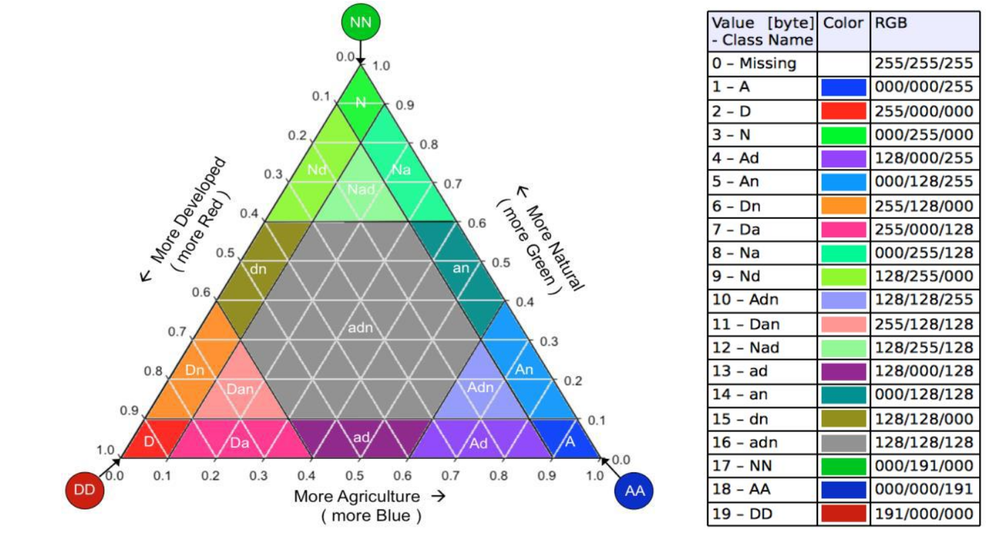

Landscape Mosaic
================

The Landscape Mosaic analysis classifies each pixel based on the
proportional composition of three land cover classes within a moving
window. The result describes the local landscape context of each pixel
in terms of the dominant land cover mixture, producing up to 103
compositional classes subsequently remapped to 19 aggregated classes.
The methodology is described in detail in the `Landscape Mosaic sheet
<https://ies-ows.jrc.ec.europa.eu/gtb/GTB/psheets/GTB-Pattern-LM.pdf>`_.

Functions
---------

.. py:function:: pyguidos.landmos(in_tiff, window_size, outdir=None, statists=True, stat_files=True, out_colors='bgr', verb=False)

   Performs Landscape Mosaic analysis on a three-class raster using a moving
   window. Each pixel is classified from the proportional composition of the
   three land cover classes within the window, producing up to 103
   compositional classes that are also remapped to 19 aggregated classes.

   :param in_tiff: Path to input GeoTIFF (uint8: 0=NoData, 1=Class 1 e.g. Agriculture, 2=Class 2 e.g. Natural, 3=Class 3 e.g. Developed).
   :type in_tiff: str or Path
   :param window_size: Size of the moving window in pixels. Must be an odd integer >= 3.
   :type window_size: int
   :param outdir: Output directory. If ``None`` (default, outputs are written to the input file's directory.
   :type outdir: str or Path, optional
   :param statists: If ``True``, computes and returns statistics.
   :type statists: bool, optional
   :param stat_files: If ``True``, writes .txt, .csv and .png report files.
   :type stat_files: bool, optional
   :param out_colors: Color scheme for the 103-class output colormap: ``'agr'``, ``'ant'``, ``'bgr'``, ``'dev'``, ``'div'`` or ``'nat'``.
   :type out_colors: str, optional
   :param verb: If ``True``, prints progress messages.
   :type verb: bool, optional

   :returns: **dict** -- A dictionary containing three main sections:

       * ``"output paths"`` (*dict* or *None*):
           * ``"path tif 103cl"`` (*str*) -- Absolute path to the 103-class result GeoTIFF.
           * ``"path tif 19cl"`` (*str*) -- Absolute path to the aggregated 19-class result GeoTIFF.
           * ``"path txt"`` (*str*) -- Absolute path to the statistics report.
           * ``"path csv"`` (*str*) -- Absolute path to the per-value pixel count CSV.
           * ``"path csv hm"`` (*str*) -- Absolute path to the ternary diagram data table CSV.
           * ``"path png"`` (*str*) -- Absolute path to the ternary diagram heatmap.
       * ``"input stats"`` (*dict*):
           * ``"class1 pxl"`` (*int*) -- Count of input Class 1 pixels.
           * ``"class2 pxl"`` (*int*) -- Count of input Class 2 pixels.
           * ``"class3 pxl"`` (*int*) -- Count of input Class 3 pixels.
           * ``"foreground pxl"`` (*int*) -- Total count of valid (non-missing) pixels.
           * ``"missing pxl"`` (*int*) -- Count of NoData pixels.
       * ``"output stats"`` (*dict*):
           * ``"pxl numb 103cl"`` (*dict*) -- Pixel counts for the detailed 103-class classification.
           * ``"pxl numb 19cl"`` (*dict*) -- Pixel counts for the aggregated 19-class classification.

   :outputs: The function writes the following output files with ``stat_files=True``:

       * ``<input_filename>_lm_<window_size>_103class_<out_colors>.tif``: 103-class Landscape Mosaic result GeoTIFF with color palette
       * ``<input_filename>_lm_<window_size>_19class.tif``: 19-class remapped result GeoTIFF
       * ``<input_filename>_lm_<window_size>.txt``: Statistics report
       * ``<input_filename>_lm_<window_size>.csv``: Per-value pixel counts and frequencies
       * ``<input_filename>_lm_<window_size>_heatmap.csv``: Ternary diagram data table
       * ``<input_filename>_lm_<window_size>_heatmap.png``: Ternary diagram heatmap

   .. rubric:: Example
   Standard execution of the Landscape Mosaic analysis on a three-class land
   cover raster:

   .. code-block:: python

        >>> import pyguidos as pg
        >>> land_mosaic = pg.DATA_DIR / "CLC2018_corsica_LandMos.tif"
        >>> lm_result = pg.landmos(in_tiff=land_mosaic, window_size=31,
        ... outdir="output/", statists=True, stat_files=True,
        ... out_colors='bgr', verb=False)
        >>> lm_result
        >>> lm_result['output paths']['path tif 19cl']
        {'0-NoData': 932069,
         '1-A': 6529,
         '2-D': 67,
         '3-N': 255326,
         '4-Ad': 2881,
         '5-An': 22953,
         '6-Dn': 1127,
         '7-Da': 147,
         '8-Na': 155467,
         '9-Nd': 12571,
         '10-Adn': 3107,
         '11-Dan': 414,
         '12-Nad': 11010,
         '13-ad': 595,
         '14-an': 35228,
         '15-dn': 1874,
         '16-adn': 32867,
         '17-NN': 330442,
         '18-AA': 326,
         '19-DD': 0}

.. py:function:: pyguidos.landmos_stats(lm_tiff, stat_files=True, outdir=None, source_tiff=None)

   Computes statistics for an existing 103-class Landscape Mosaic result
   GeoTIFF and generates the ternary diagram heatmap.

   :param lm_tiff: Path to the 103-class Landscape Mosaic result GeoTIFF (must carry a valid ``GTB_LM`` metadata tag).
   :type lm_tiff: str or Path
   :param stat_files: If ``True``, writes .txt, .csv and .png report files.
   :type stat_files: bool, optional
   :param outdir: Directory for output files. Defaults to the input file's directory.
   :type outdir: str or Path, optional
   :param source_tiff: Path to the original three-class input GeoTIFF. When provided, per-class input pixel counts are reported; otherwise they are shown as ``"n/a"``.
   :type source_tiff: str or Path, optional

   :returns: **dict** -- A dictionary containing three main sections:

       * ``"output paths"`` (*dict* or *None*):
           * ``"path tif 103cl"`` (*str*) -- Absolute path to the used 103-class GeoTIFF.
           * ``"path txt"`` (*str*) -- Absolute path to the statistics report.
           * ``"path csv"`` (*str*) -- Absolute path to the per-value pixel count CSV.
           * ``"path csv hm"`` (*str*) -- Absolute path to the ternary diagram data table CSV.
           * ``"path png"`` (*str*) -- Absolute path to the ternary diagram heatmap.
       * ``"input stats"`` (*dict*):
           * ``"class1 pxl"`` (*int* or *str*) -- Count of input Class 1 pixels, or ``"n/a"`` when ``source_tiff`` is not provided.
           * ``"class2 pxl"`` (*int* or *str*) -- Count of input Class 2 pixels, or ``"n/a"``.
           * ``"class3 pxl"`` (*int* or *str*) -- Count of input Class 3 pixels, or ``"n/a"``.
           * ``"foreground pxl"`` (*int*) -- Total count of valid (non-missing) pixels.
           * ``"missing pxl"`` (*int*) -- Count of NoData pixels.
       * ``"output stats"`` (*dict*):
           * ``"pxl numb 103cl"`` (*dict*) -- Pixel counts for the detailed 103-class classification.
           * ``"pxl numb 19cl"`` (*dict*) -- Pixel counts for the aggregated 19-class classification.

   :outputs: The function writes the following output files with ``stat_files=True``:

       * ``<lm_filename>.txt``: Statistics report
       * ``<lm_filename>.csv``: Per-value pixel counts and frequencies
       * ``<lm_filename>_heatmap.csv``: Ternary diagram data table
       * ``<lm_filename>_heatmap.png``: Ternary diagram heatmap

   .. rubric:: Example
   After executing the Landscape Mosaic analysis, pass the 103-class result
   GeoTIFF to ``landmos_stats()`` to extract summary statistics. Provide
   ``source_tiff`` to report the per-class input pixel counts.

   .. code-block:: python

        >>> lm_tiff = 'output/my_landcover_lm_31_103class_bgr.tif'
        >>> lm_stats = pg.landmos_stats(lm_tiff=lm_tiff, stat_files=True,
        ... outdir='output/', source_tiff="my_landcover.tif")
        >>> lm_stats['input stats']
        {'class1 pxl': 98525,
         'class2 pxl': 751504,
         'class3 pxl': 22902,
         'foreground pxl': 872931,
         'missing pxl': 932069}

Output Classes
--------------

The 19-class aggregation is based on the proportion of the three input
land cover classes within the moving window. By default, the three classes
are interpreted as:

.. list-table::
   :header-rows: 1
   :widths: 15 25 15

   * - Pixel Value
     - Default Interpretation
     - Color
   * - 1
     - Agriculture
     - Blue
   * - 2
     - Natural
     - Green
   * - 3
     - Developed
     - Red

.. note::
    The class assignment is purely conventional. Pixel values 1, 2 and 3
    can represent any three mutually exclusive land cover types defined
    by the user (e.g. Forest/Non-forest/Water, Urban/Rural/Natural).
    The labels Agriculture, Natural and Developed are used throughout
    this documentation for consistency with the GuidosToolbox convention,
    but the analysis is valid for any three-class input map.

    The Landscape Mosaic triangle with the 19 classes and their proportions
    to the three land cover types Agriculture, Natural, and Developed.

Each of the 19 aggregated classes is defined by the combination of
proportions of the three input classes within the moving window:

.. list-table:: Landscape Mosaic 19-class aggregation scheme.
   :header-rows: 1

   * - N
     - Code
     - Description
     - AGR [%]
     - NAT [%]
     - DEV [%]
   * - 1
     - A
     - Agriculture dominant
     - [80-100[
     - [0-10[
     - [0-10[
   * - 2
     - D
     - Developed dominant
     - [0-10[
     - [0-10[
     - [80-100[
   * - 3
     - N
     - Natural dominant
     - [0-10[
     - [80-100[
     - [0-10[
   * - 4
     - Ad
     - Agriculture with Developed
     - [60-90[
     - [0-10[
     - [10-60[
   * - 5
     - An
     - Agriculture with Natural
     - [60-90[
     - [10-40[
     - [0-10[
   * - 6
     - Dn
     - Developed with Natural
     - [0-10[
     - [10-40[
     - [60-90[
   * - 7
     - Da
     - Developed with Agriculture
     - [10-40[
     - [0-10[
     - [60-90[
   * - 8
     - Na
     - Natural with Agriculture
     - [10-40[
     - [60-90[
     - [0-10[
   * - 9
     - Nd
     - Natural with Developed
     - [0-10[
     - [60-90[
     - [10-40[
   * - 10
     - Adn
     - Agriculture dominant mixed
     - [60-80[
     - [10-40[
     - [10-40[
   * - 11
     - Dan
     - Developed dominant mixed
     - [10-40[
     - [10-40[
     - [60-80[
   * - 12
     - Nad
     - Natural dominant mixed
     - [10-40[
     - [60-80[
     - [10-40[
   * - 13
     - ad
     - Agriculture-Developed transition
     - [30-60[
     - [0-10[
     - [30-60[
   * - 14
     - an
     - Agriculture-Natural transition
     - [30-60[
     - [30-60[
     - [0-10[
   * - 15
     - dn
     - Developed-Natural transition
     - [0-10[
     - [30-60[
     - [30-60[
   * - 16
     - adn
     - Mixed transition
     - [10-60[
     - [10-60[
     - [10-60[
   * - 17
     - NN
     - Pure Natural (100%)
     - [0]
     - [100]
     - [0]
   * - 18
     - AA
     - Pure Agriculture (100%)
     - [100]
     - [0]
     - [0]
   * - 19
     - DD
     - Pure Developed (100%)
     - [0]
     - [0]
     - [100]

References
----------

- Riitters K H, Wickham J D, Wade T G, 2009. An indicator of forest dynamics
  using a shifting landscape mosaic. Ecological Indicators 9: 107-117.
  DOI: `10.1016/j.ecolind.2008.02.003
  <https://dx.doi.org/10.1016/j.ecolind.2008.02.003>`_.

- Vogt P, Wickham J, Barredo J I, Riitters K, 2024. Revisiting the Landscape
  Mosaic model. PLoS ONE 19(5): e0304215. DOI: `10.1371/journal.pone.0304215
  <https://doi.org/10.1371/journal.pone.0304215>`_.
