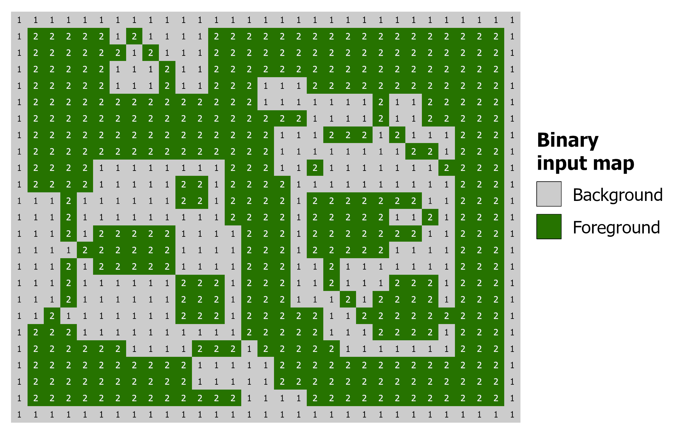
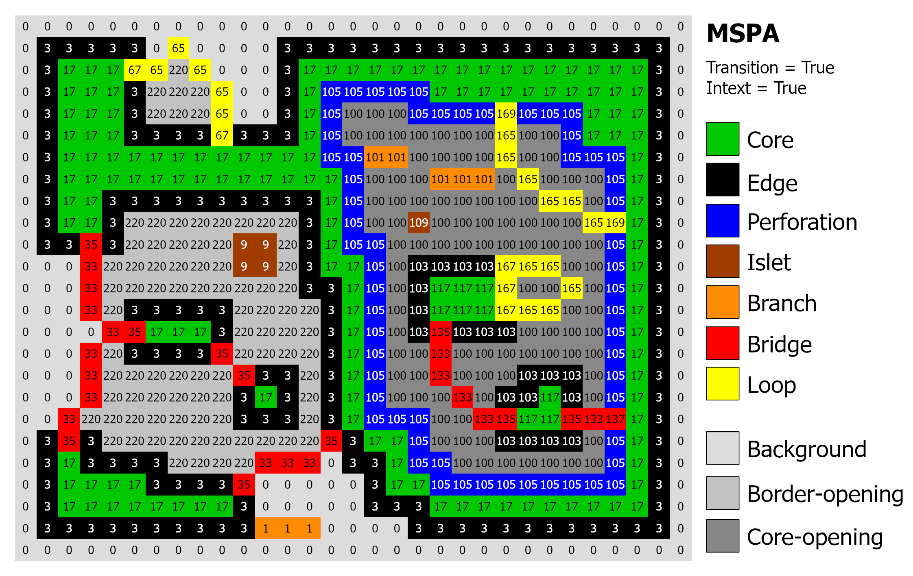
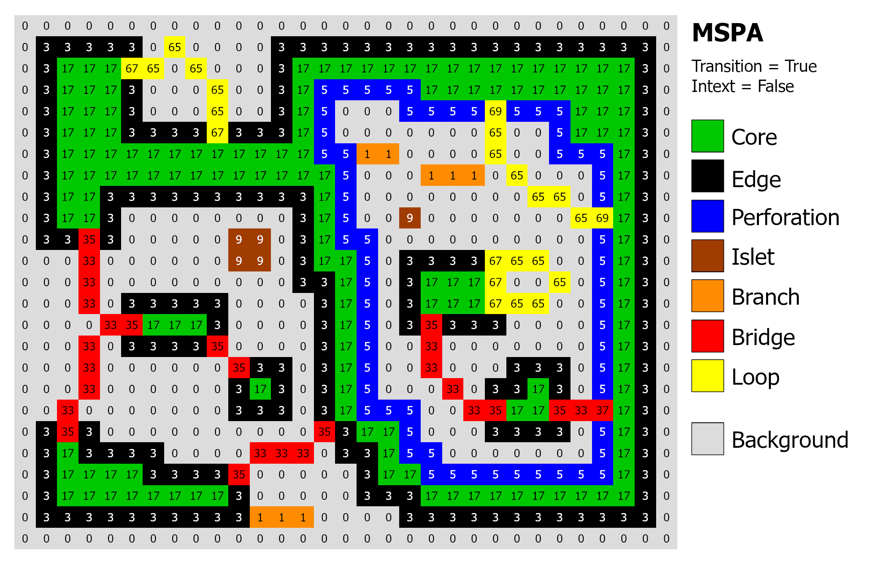
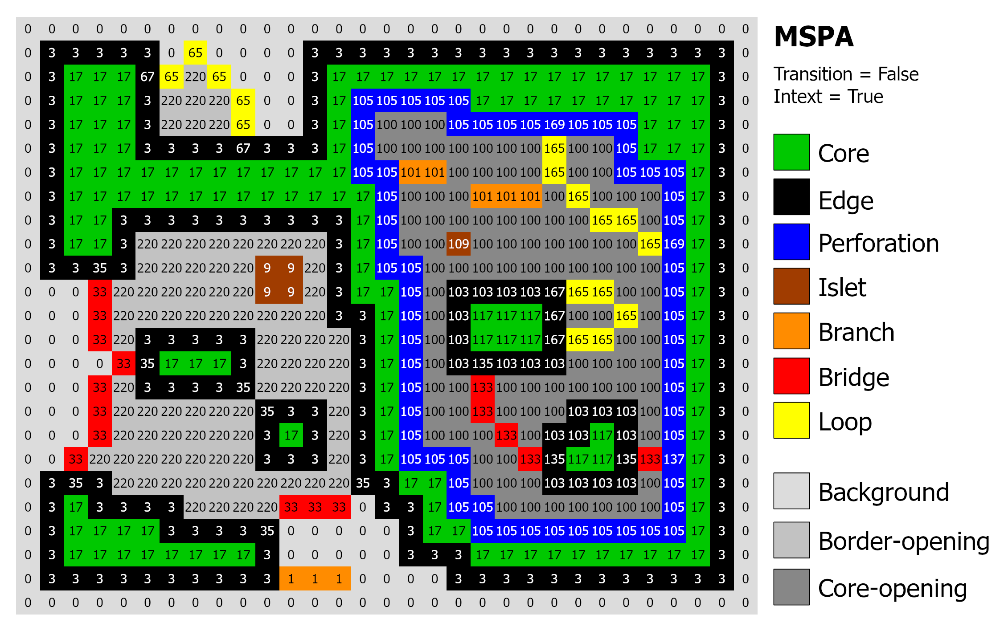

Morphology MSPA
===============

Morphological Spatial Pattern Analysis (MSPA) segments the foreground of a
binary pattern into mutually exclusive morphological classes describing the
geometry and connectivity of the image components: core, islet, edge,
perforation, bridge, loop, branch.
Further details are available in the `MSPA product sheet
<https://ies-ows.jrc.ec.europa.eu/gtb/GTB/psheets/GTB-Pattern-Morphology.pdf>`_
and the `MSPA guide
<https://ies-ows.jrc.ec.europa.eu/gtb/GTB/MSPA_Guide.pdf>`_.

.. note::
    MSPA is the full morphological segmentation. For a faster, streamlined
    subset of the same idea implemented in pure Python, see :doc:`morph_spa`
    (Simplified Pattern Analysis, SPA).

Parameters
----------

.. list-table::
   :header-rows: 1

   * - Parameter
     - Type
     - Default
     - Description
   * - ``in_tiff``
     - str or Path
     - --
     - Path to input GeoTIFF (0=NoData, 1=Background, 2=Foreground)
   * - ``connectivity``
     - int
     - 8
     - Foreground connectivity, 8 or 4
   * - ``edge_width``
     - int
     - 1
     - Width of the edge/transition zone in pixels (>= 1)
   * - ``transition``
     - bool
     - True
     - If True, distinguish transition pixels (Loop/Bridge in Edge/Perf.)
   * - ``intext``
     - bool
     - True
     - If True, separate internal (+100) from external features
   * - ``outdir``
     - str or Path
     - None
     - Output directory. Defaults to input directory
   * - ``statists``
     - bool
     - True
     - If True, computes and returns statistics
   * - ``stat_files``
     - bool
     - True
     - If True, writes a .txt report file
   * - ``verb``
     - bool
     - False
     - If True, prints progress messages

Example with all parameters:

.. code-block:: python

    import pyguidos as pg

    result = pg.mspa(
        in_tiff="my_input.tif",
        connectivity=8,
        edge_width=1,
        transition=True,
        intext=True,
        outdir="output/",
        statists=True,
        stat_files=True,
        verb=False
    )

Output Files
------------

.. list-table::
   :header-rows: 1

   * - File
     - Description
   * - ``<name>_<conn>_<ew>_<trans>_<intext>.tif``
     - MSPA result GeoTIFF with color palette
   * - ``<name>_<conn>_<ew>_<trans>_<intext>.txt``
     - Statistics report

For example, ``input.tif`` analysed with ``connectivity=8``, ``edge_width=1``,
``transition=True`` and ``intext=True`` produces ``input_8_1_1_1.tif``.

Output Classes
--------------

Each foreground pixel is assigned to one of the seven morphological classes and
mapped in the output GeoTIFF as a byte value with an associated display color.
The pixel value and color of a class depend on the ``transition`` and
``intext`` parameters:

* With ``transition = True`` the Loop or Bridge pixels that traverse an Edge or
  a Perforation are kept as their own class and shown in their Loop/Bridge
  color; with ``transition = False`` these pixels take the color of the
  underlying Edge or Perforation.
* With ``intext = True`` the features within an internal hole/core-opening are
  separated from the external ones by adding **+100** to the class value.

pyGuidos ships two palettes accordingly, ``mspa_colormap_trans1.txt`` (used
when ``transition=True``) and ``mspa_colormap_trans0.txt`` (used when
``transition=False``), and selects the correct one automatically so the colors
match the GuidosToolbox (GTB) MSPA output.

.. list-table:: MSPA class names, colors and byte values.
   :widths: 24 16 16 14 14
   :header-rows: 1

   * - Class
     - | Color
       | (``transition=True``)
     - | Color
       | (``transition=False``)
     - | Value
       | (``intext=False``)
     - | Value
       | (``intext=True``)
   * - Core
     - green
     - green
     - 17
     - 17 / 117
   * - Islet
     - brown
     - brown
     - 9
     - 9 / 109
   * - Perforation
     - blue
     - blue
     - 5
     - 5 / 105
   * - Edge
     - black
     - black
     - 3
     - 3 / 103
   * - Loop
     - yellow
     - yellow
     - 65
     - 65 / 165
   * - Loop in Edge
     - yellow
     - black
     - 67
     - 67 / 167
   * - Loop in Perforation
     - yellow
     - blue
     - 69
     - 69 / 169
   * - Bridge
     - red
     - red
     - 33
     - 33 / 133
   * - Bridge in Edge
     - red
     - black
     - 35
     - 35 / 135
   * - Bridge in Perforation
     - red
     - blue
     - 37
     - 37 / 137
   * - Branch
     - orange
     - orange
     - 1
     - 1 / 101
   * - Background
     - light grey
     - light grey
     - 0
     - 0
   * - Border-Opening
     - grey
     - grey
     - N/A
     - 220
   * - Core-Opening
     - dark grey
     - dark grey
     - N/A
     - 100
   * - No Data
     - white
     - white
     - 129
     - 129

.. note::
    Internal values (``+100``) are only present when ``intext=True``.
    When ``transition=False`` the Loop/Bridge-in-Edge/Perforation values
    (``35``, ``37``, ``67``, ``69`` and their ``+100`` variants) take the
    Edge or Perforation color, as shown above.

    Example of input binary map used for MSPA.

    MSPA output with displayed transition pixels and internal pixels.

    MSPA output with transition pixels and without internal pixels.

    MSPA output without transition pixels and with internal pixels.

Statistics
----------

Result Dictionary
^^^^^^^^^^^^^^^^^^

The ``mspa()`` function returns a :class:`dict` with three sections:

* **output paths** (:class:`dict` or :obj:`None`)
    * **path tif** (:class:`str`): Absolute path to the MSPA result GeoTIFF.
    * **path txt** (:class:`str`): Absolute path to the MSPA statistics report.
    * *Note: This key is* ``None`` *if* ``stat_files=False``.

* **input stats** (:class:`dict`)
    * **foreground pxl** (:class:`int`): Count of foreground pixels.
    * **background pxl** (:class:`int`): Count of background pixels.
    * **missing pxl** (:class:`int`): Count of NoData pixels.

* **output stats** (:class:`dict`)
    * **class freq** (:class:`dict`): Per-value pixel counts, grouped into
      External, Internal and Background sections.
    * **aggregated foregr** (:class:`dict`): Pixel counts for the seven
      aggregated foreground classes (external + internal + variants).
    * **integral foregr** (:class:`int`): Morphological foreground plus
      core-openings.
    * **porosity** (:class:`float`): Core-openings as a percentage of the
      integral foreground.

Accessing the result:

.. code-block:: python

    result = pg.mspa("my_input.tif", edge_width=1)

    # Output file paths
    tif_path = result['output paths']['path tif']
    txt_path = result['output paths']['path txt']

    # Input pixel counts
    fg = result['input stats']['foreground pxl']

    # Class frequencies and derived indicators
    freq = result['output stats']['class freq']
    porosity = result['output stats']['porosity']

Computing Statistics Separately
^^^^^^^^^^^^^^^^^^^^^^^^^^^^^^^^

If you already have an MSPA output GeoTIFF, you can compute statistics
without re-running the analysis:

.. code-block:: python

    stats = pg.mspa_stats(
        mspa_tiff="output/input_8_1_1_1.tif",
        stat_files=True,
        outdir="output/",
        source_tiff="input.tif"
    )

.. note::
    ``mspa_stats()`` requires the input GeoTIFF to contain the ``GTB_MSPA``
    metadata tag (written automatically by ``mspa()``).

License note
------------

MSPA is computed by the original ``miallib`` C implementation of Soille and
Vogt, bundled inside pyGuidos and compiled as an internal extension. The
output is **bit-identical** to the GuidosToolbox (GTB) MSPA result for the
same parameters.
The vendored ``miallib`` MSPA sources are licensed under the GNU General
Public License v3 (GPLv3). Because MSPA is compiled into pyGuidos, the
distributed package as a whole is provided under the GPLv3. See the project
``LICENSE`` file and :doc:`../index` for details.

References
----------

- Soille P, Vogt P, 2009. Morphological segmentation of binary patterns.
  Pattern Recognition Letters 30(4):456-459. DOI: `10.1016/j.patrec.2008.10.015
  <https://doi.org/10.1016/j.patrec.2008.10.015>`_.

- Vogt P, Riitters K, 2017. GuidosToolbox: universal digital image object
  analysis. European Journal of Remote Sensing 50(1), 352-361. DOI:
  `10.1080/22797254.2017.1330650 <https://doi.org/10.1080/22797254.2017.1330650>`_.
