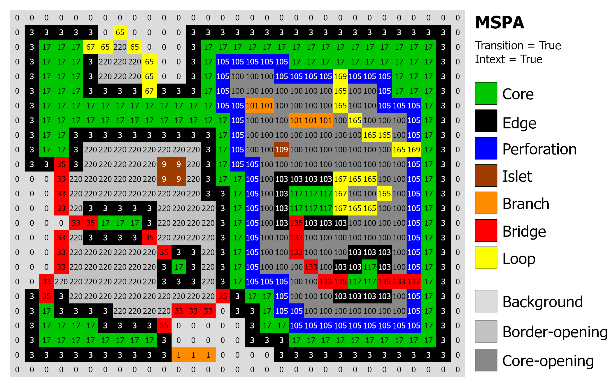
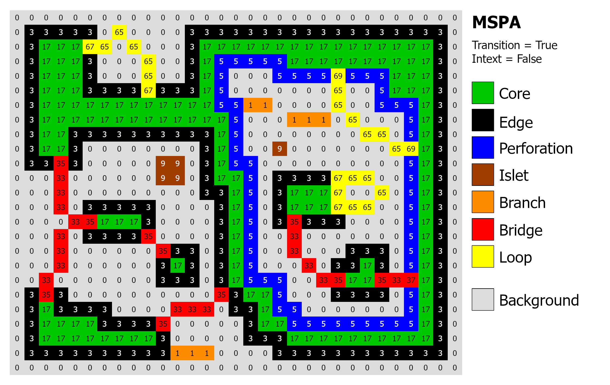
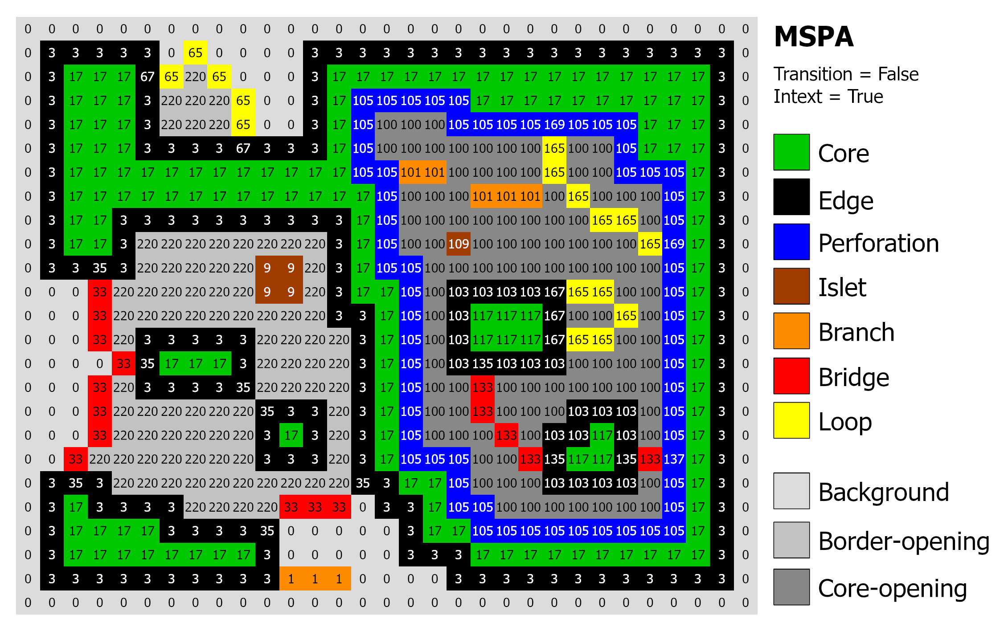

Morphology MSPA
===============

Morphological Spatial Pattern Analysis (MSPA) segments the foreground of a
binary pattern into mutually exclusive morphological classes describing the
geometry and connectivity of the image components: core, islet, edge,
perforation, bridge, loop, branch.
Further details are available in the `MSPA product sheet
<https://ies-ows.jrc.ec.europa.eu/gtb/GTB/psheets/GTB-Pattern-Morphology.pdf>`_
and the `MSPA guide
<https://ies-ows.jrc.ec.europa.eu/gtb/GTB/MSPA_Guide.pdf>`_.

.. note::
    MSPA is the full morphological segmentation. For a faster, streamlined
    subset of the same idea implemented in pure Python, see :doc:`morph_spa`
    (Simplified Pattern Analysis, SPA).

Functions
---------

.. py:function:: pyguidos.mspa(in_tiff, connectivity=8, edge_width=1, transition=True, intext=True, outdir=None, statists=True, stat_files=True, verb=False)

   MSPA segments the foreground of a binary pattern into mutually exclusive
   morphological classes (core, islet, edge, perforation, bridge, loop,
   branch, and their variants).

   :param in_tiff: Path to input GeoTIFF (0=NoData, 1=Background, 2=Foreground).
   :type in_tiff: str or Path
   :param connectivity: Foreground connectivity, 8 or 4.
   :type connectivity: int, optional
   :param edge_width: Width of the edge/transition zone in pixels (>= 1).
   :type edge_width: int, optional
   :param transition: If ``True``, distinguish transition pixels (Loop/Bridge in Edge/Perf.).
   :type transition: bool, optional
   :param intext: If ``True``, separate internal (+100) from external features.
   :type intext: bool, optional
   :param outdir: Output directory. If ``None`` (default), outputs are written to the input file's directory.
   :type outdir: str or Path, optional
   :param statists: If ``True``, computes and returns statistics.
   :type statists: bool, optional
   :param stat_files: If ``True``, writes a .txt report file.
   :type stat_files: bool, optional
   :param verb: If ``True``, prints progress messages.
   :type verb: bool, optional

   :returns: **dict** -- A dictionary containing three main sections:
   
       * ``"output paths"`` (*dict* or *None*):
           * ``"path tif"`` (*str*) -- Absolute path to the result GeoTIFF.
           * ``"path txt"`` (*str*) -- Absolute path to the statistics report.
       * ``"input stats"`` (*dict*):
           * ``"foreground pxl"`` (*int*) -- Count of foreground pixels.
           * ``"background pxl"`` (*int*) -- Count of background pixels.
           * ``"missing pxl"`` (*int*) -- Count of NoData pixels.
       * ``"output stats"`` (*dict*):
           * ``"class freq"`` (*dict*) -- Pixel counts for all 23 + 3 classes groupped in External, Internal and Background.
           * ``"class freq aggr"`` (*dict*) -- Pixel counts for the 7 + 1 aggregated classes.
           * ``"integral foregr"`` (*int*) -- Integral foreground pixel count.
           * ``"porosity"`` (*float*) -- Porosity percentage.
       
       
   :outputs: The function writes the following output files with ``stat_files=True``:
	   
       * ``<input_filename>_<connectivity>_<edge_width>_<transition>_<intext>.tif``: MSPA result GeoTIFF with color palette
       * ``<input_filename>_<connectivity>_<edge_width>_<transition>_<intext>.txt``: Statistics report
   
   .. rubric:: Example
   Standard execution of MSPA analysis with default parameters using the Forest/Non-Forest 
   GeoTIFF file of Corsica stored on ``pyguidos/data`` folder:

   .. code-block:: python

        >>> import pyguidos as pg
        >>> forest_map = pg.DATA_DIR / "CLC2018_corsica_FNF.tif"		
        >>> mspa_result = pg.mspa(in_tiff=forest_map, connectivity=8, edge_width=1,
        ... transition=True, intext=True, outdir="output/", statists=True,
        ... stat_files=True, verb=False)
        >>> mspa_result['output stats']['class freq aggr']
        {'Core': 200934,
         'Edge': 61706,
         'Perforation': 9331,
         'Islet': 978,
         'Branch': 22054,
         'Loop': 1896,
         'Bridge': 3838}
        >>> mspa_result['output paths']['path txt']
        'output/CLC2018_corsica_FNF_8_1_1_1.tif'        

.. py:function:: pyguidos.mspa_stats(mspa_tiff, stat_files=True, outdir=None, source_tiff=None)
   
   Computes statistics for an existing MSPA result GeoTIFF.

   :param mspa_tiff: Path to input GeoTIFF (0=NoData, 1=Background, 2=Foreground).
   :type mspa_tiff: str or Path
   :param stat_files: If ``True``, writes the .txt report file.
   :type stat_files: bool, optional
   :param outdir: Directory for output files. Defaults to the input file's directory.
   :type outdir: str or Path, optional
   :param source_tiff: Path to the original input GeoTIFF used to generate the MSPA result.
   :type source_tiff: str or Path, optional
   
   :returns: **dict** -- A dictionary containing three main sections:
   
       * ``"output paths"`` (*dict* or *None*):
           * ``"path tif"`` (*str*) -- Absolute path to the used mspa GeoTIFF.
           * ``"path txt"`` (*str*) -- Absolute path to the statistics report.
       * ``"input stats"`` (*dict*):
           * ``"foreground pxl"`` (*int*) -- Count of foreground pixels.
           * ``"background pxl"`` (*int*) -- Count of background pixels.
           * ``"missing pxl"`` (*int*) -- Count of NoData pixels.
       * ``"output stats"`` (*dict*):
           * ``"class freq"`` (*dict*) -- Pixel counts for all 23 + 3 classes groupped in External, Internal and Background.
           * ``"class freq aggr"`` (*dict*) -- Pixel counts for the 7 + 1 aggregated classes.
           * ``"integral foregr"`` (*int*) -- Integral foreground pixel count.
           * ``"porosity"`` (*float*) -- Porosity percentage.
       
       
   :outputs: The function writes the following output file with ``stat_files=True``:
	   
       * ``<input_filename>_<connectivity>_<edge_width>_<transition>_<intext>.txt``: Statistics report
   
   .. rubric:: Example
   After executing the MSPA analysis of Corsica, pass the resulting GeoTIFF to 
   ``mspa_stats()`` to extract detailed summary statistics.

   .. code-block:: python

        >>> mspa_tiff = 'output/CLC2018_corsica_FNF_8_1_1_1.tif'
        >>> mspa_stats = pg.mspa_stats(mspa_tiff=mspa_tiff, stat_files=True,
        ... outdir='output/', source_tiff=None)
        >>> mspa_stats['output stats']['porosity']
        4.893938440234152

MSPA Classes
------------

Each foreground pixel is assigned to one of the seven morphological classes and
mapped in the output GeoTIFF as a byte value with an associated display color.
The pixel value and color of a class depend on the ``transition`` and
``intext`` parameters:

* With ``transition = True`` the Loop or Bridge pixels that traverse an Edge or
  a Perforation are kept as their own class and shown in their Loop/Bridge
  color; with ``transition = False`` these pixels take the color of the
  underlying Edge or Perforation.
* With ``intext = True`` the features within an internal hole/core-opening are
  separated from the external ones by adding **+100** to the class value.

pyGuidos ships two palettes accordingly, ``mspa_colormap_trans1.txt`` (used
when ``transition=True``) and ``mspa_colormap_trans0.txt`` (used when
``transition=False``), and selects the correct one automatically so the colors
match the GuidosToolbox (GTB) MSPA output.

.. list-table:: MSPA class names, colors and byte values.
   :widths: 24 16 16 14 14
   :header-rows: 1

   * - Class
     - | Color
       | (``transition=True``)
     - | Color
       | (``transition=False``)
     - | Value
       | (``intext=False``)
     - | Value
       | (``intext=True``)
   * - Core
     - green
     - green
     - 17
     - 17 / 117
   * - Islet
     - brown
     - brown
     - 9
     - 9 / 109
   * - Perforation
     - blue
     - blue
     - 5
     - 5 / 105
   * - Edge
     - black
     - black
     - 3
     - 3 / 103
   * - Loop
     - yellow
     - yellow
     - 65
     - 65 / 165
   * - Loop in Edge
     - yellow
     - black
     - 67
     - 67 / 167
   * - Loop in Perforation
     - yellow
     - blue
     - 69
     - 69 / 169
   * - Bridge
     - red
     - red
     - 33
     - 33 / 133
   * - Bridge in Edge
     - red
     - black
     - 35
     - 35 / 135
   * - Bridge in Perforation
     - red
     - blue
     - 37
     - 37 / 137
   * - Branch
     - orange
     - orange
     - 1
     - 1 / 101
   * - Background
     - light grey
     - light grey
     - 0
     - 0
   * - Border-Opening
     - grey
     - grey
     - N/A
     - 220
   * - Core-Opening
     - dark grey
     - dark grey
     - N/A
     - 100
   * - No Data
     - white
     - white
     - 129
     - 129

.. note::
    Internal values (``+100``) are only present when ``intext=True``.
    When ``transition=False`` the Loop/Bridge-in-Edge/Perforation values
    (``35``, ``37``, ``67``, ``69`` and their ``+100`` variants) take the
    Edge or Perforation color, as shown above.

.. figure:: ../_image/FM.png
    :width: 80%
    :align: center
    :alt: Forest map

    Example of input binary map used for MSPA.

    MSPA output with displayed transition pixels and internal pixels.

    MSPA output with transition pixels and without internal pixels.

    MSPA output without transition pixels and with internal pixels.

Aggregated classes
^^^^^^^^^^^^^^^^^^

The 22 morphological pixel values are
summarised into 7 aggregated classes. Transition pixels (Loop or Bridge
crossing an Edge or a Perforation) are counted with the class they cross,
not with Loop/Bridge:

* **Core**, **Islet**, **Branch** — their external and internal values.
* **Edge** = Edge + Loop-in-Edge + Bridge-in-Edge (external and internal).
* **Perforation** = Perforation + Loop-in-Perforation + Bridge-in-Perforation
  (external and internal).
* **Loop** = only the plain Loop pixels not touching an Edge or Perforation
  (external and internal).
* **Bridge** = only the plain Bridge pixels not touching an Edge or Perforation
  (external and internal).

Morphological indices
---------------------

.. raw:: html

   Integral Foreground
   
The foreground footprint including its internal openings:

.. math::

   \text{Integral FG} = \text{Foreground} + \text{Core-Opening} + \text{Border-Opening}

where *Foreground* is the sum of all 22 morphological class pixels.

.. raw:: html

   Porosity

The share of the contiguous foreground occupied by core-openings:

.. math::

   \text{Porosity} = 100 - 100 \times \frac{\text{Contiguous}}{\text{Contiguous} + \text{Core-Opening}}

where *Contiguous* is Core + Edge + Perforation using the aggregated Edge/Perforation (see above)

License note
------------

MSPA is computed by a native-Python re-implementation of the original
``miallib`` MSPA algorithm of Soille and Vogt. The output is **bit-identical**
to the GuidosToolbox (GTB) MSPA result for the same parameters on the image
interior (the only difference is a one-pixel symmetric border treatment on the
right/bottom edges).
Because the engine is a derivative work of the GPLv3-licensed ``miallib``
sources, the distributed pyGuidos package as a whole is provided under the GNU
General Public License v3 (GPLv3). See the project ``LICENSE`` file and
:doc:`../index` for details.

References
----------

- Soille P, Vogt P, 2009. Morphological segmentation of binary patterns.
  Pattern Recognition Letters 30(4):456-459. DOI: `10.1016/j.patrec.2008.10.015
  <https://doi.org/10.1016/j.patrec.2008.10.015>`_.

- Vogt P, Riitters K, 2017. GuidosToolbox: universal digital image object
  analysis. European Journal of Remote Sensing 50(1), 352-361. DOI:
  `10.1080/22797254.2017.1330650 <https://doi.org/10.1080/22797254.2017.1330650>`_.
