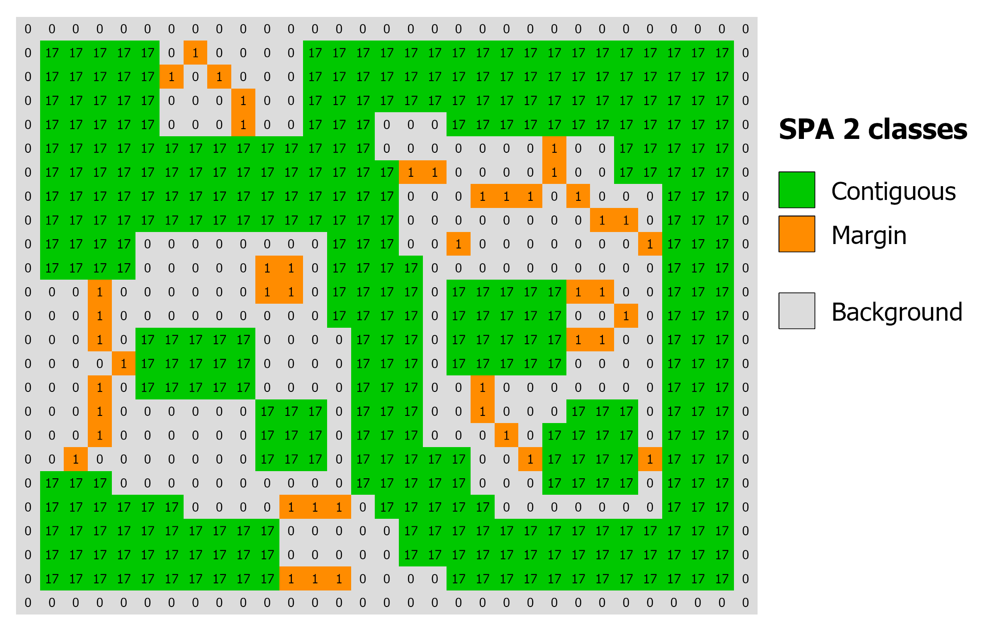
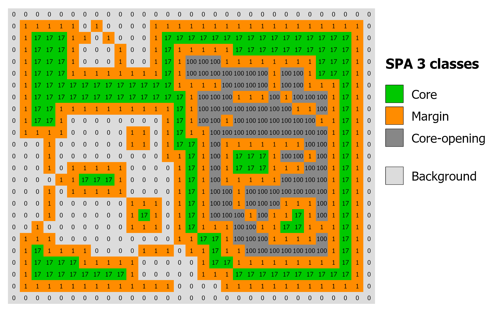
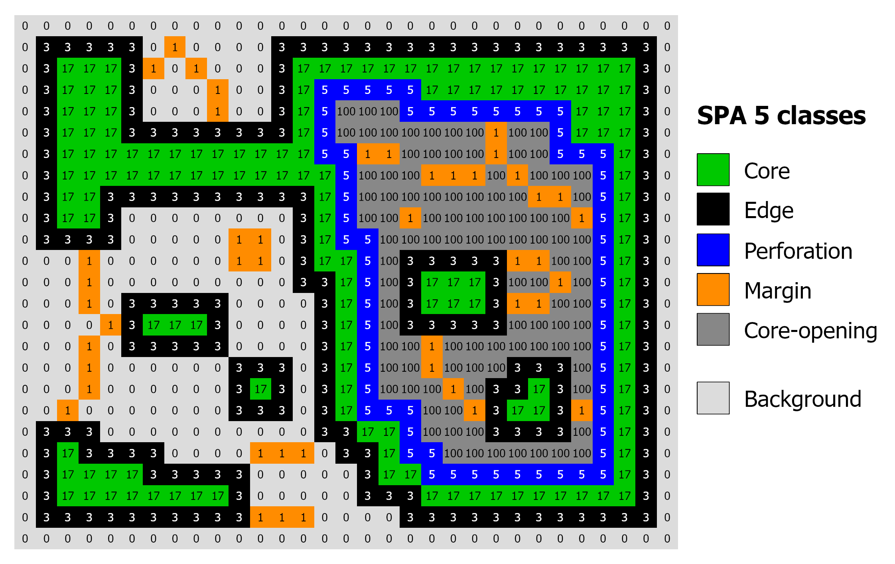
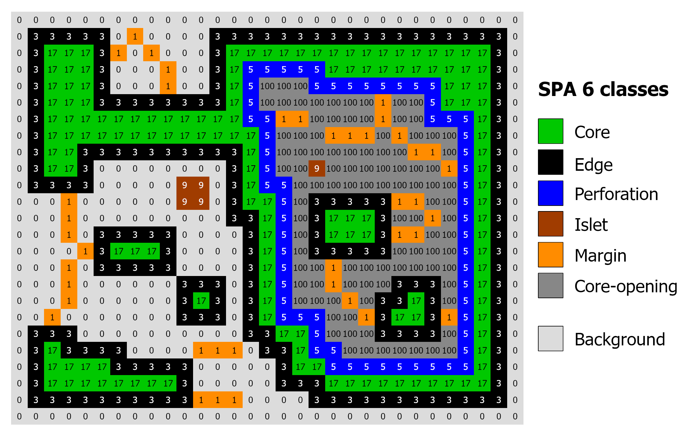

Morphology SPA
==============

Simplified Pattern Analysis (SPA) is a streamlined version of the
MSPA approach. It classifies pixels of a binary foreground/background image into
morphological classes based on their spatial context, offering four different
classification levels (2, 3, 5, or 6 classes).
Further details about SPA and MSPA are available in the `MSPA product sheet
<https://ies-ows.jrc.ec.europa.eu/gtb/GTB/psheets/GTB-Pattern-Morphology.pdf>`_.

.. note::
    SPA is a fast, pure-Python subset of the full morphological segmentation.
    For the complete MSPA classes and connectivity analysis, see
    :doc:`morph_mspa`.

Parameters
----------

.. list-table::
   :header-rows: 1

   * - Parameter
     - Type
     - Default
     - Description
   * - ``in_tiff``
     - str or Path
     - --
     - Path to input GeoTIFF (0=NoData, 1=Background, 2=Foreground)
   * - ``edge_width``
     - int
     - --
     - Width of the edge zone in pixels (>= 1)
   * - ``classes``
     - int
     - 6
     - Number of morphological classes (2, 3, 5, or 6)
   * - ``outdir``
     - str or Path
     - None
     - Output directory. If None (default), outputs are written to the input file's directory.
   * - ``statists``
     - bool
     - True
     - If True, computes and returns statistics
   * - ``stat_files``
     - bool
     - True
     - If True, writes a .txt report file
   * - ``verb``
     - bool
     - False
     - If True, prints progress messages

Example with all parameters:

.. code-block:: python

    import pyguidos as pg

    result = pg.spa(
        in_tiff="my_input.tif",
        edge_width=1,
        classes=6,
        outdir="output/",
        statists=True,
        stat_files=True,
        verb=False
    )

Output Files
------------

.. list-table::
   :header-rows: 1

   * - File
     - Description
   * - ``<name>_spa_<ew>_<cl>.tif``
     - SPA result GeoTIFF with color palette
   * - ``<name>_spa_<ew>_<cl>.txt``
     - Statistics report

Output Classes
--------------

The number of morphological classes in the output depends on the ``classes``
parameter. The following table describes the byte values and categories for
each level:

.. list-table:: SPA Class names and byte values.
   :widths: 20 20 60
   :header-rows: 1

   * - Level
     - Byte Value
     - Class Name
   * - **2 classes**
     - 17, 1
     - Contiguous, Margin
   * - **3 classes**
     - 17, 1, 100
     - Core, Margin, Core Opening
   * - **5 classes**
     - 17, 3, 5, 1, 100
     - Core, Edge, Perforation, Margin, Core Opening
   * - **6 classes**
     - 17, 3, 5, 9, 1, 100
     - Core, Edge, Perforation, Islet, Margin, Core Opening

.. note::
    In all modes, Background is represented by value **0**, and No Data is represented by **129**.

.. figure:: ../_image/FM.png
    :width: 80%
    :align: center
    :alt: Forest map

    Example of input binary map used for SPA.

    Derived SPA maps with 2, 3, 5 and 6 classes and edge width 1.

Statistics
----------

Result Dictionary
^^^^^^^^^^^^^^^^^^

The ``spa()`` function returns a :class:`dict` with three sections:

* **output paths** (:class:`dict` or :obj:`None`)
    * **path tif** (:class:`str`): Absolute path to the SPA result GeoTIFF.
    * **path txt** (:class:`str`): Absolute path to the SPA statistics report.
    * *Note: This key is* ``None`` *if* ``stat_files=False``.

* **input stats** (:class:`dict`)
    * **foreground pxl** (:class:`int`): Count of pixels classified as foreground.
    * **background pxl** (:class:`int`): Count of pixels classified as background.
    * **missing pxl** (:class:`int`): Count of NoData pixels.

* **output stats** (:class:`dict`)
    * **class freq** (:class:`dict`): Breakdown of pixel counts for the specific SPA classes chosen.
    * **integral foregr** (:class:`int`): The sum of foreground, background, and core-opening pixels.
    * **porosity** (:class:`float`): Calculated measure of foreground density.

Accessing the result:

.. code-block:: python

    result = pg.spa("my_input.tif", edge_width=1, classes=6)

    # Output file paths
    tif_path = result['output paths']['path tif']

    # Input pixel counts
    fg = result['input stats']['foreground pxl']

    # Class frequencies and derived indicators
    freq = result['output stats']['class freq']
    porosity = result['output stats']['porosity']

Computing Statistics Separately
^^^^^^^^^^^^^^^^^^^^^^^^^^^^^^^^

If you already have an SPA output GeoTIFF, you can compute statistics
without re-running the analysis:

.. code-block:: python

    stats = pg.spa_stats(
        spa_tiff="output/my_map_spa_6_1.tif",
        stat_files=True,
        outdir="output/",
        source_tiff="my_map.tif"
    )

.. note::
    ``spa_stats()`` requires the input GeoTIFF to contain the ``GTB_SPA``
    metadata tag (written automatically by ``spa()``).

References
----------

- Vogt P, Riitters K, 2017. GuidosToolbox: universal digital image object analysis.
  European Journal of Remote Sensing 50(1), 352-361. DOI: `10.1080/22797254.2017.1330650
  <https://doi.org/10.1080/22797254.2017.1330650>`_.

- Soille P, Vogt P, 2009. Morphological segmentation of binary patterns. Pattern Recognition
  Letters 30(4):456-459. DOI: `10.1016/j.patrec.2008.10.015
  <https://doi.org/10.1016/j.patrec.2008.10.015>`_.
