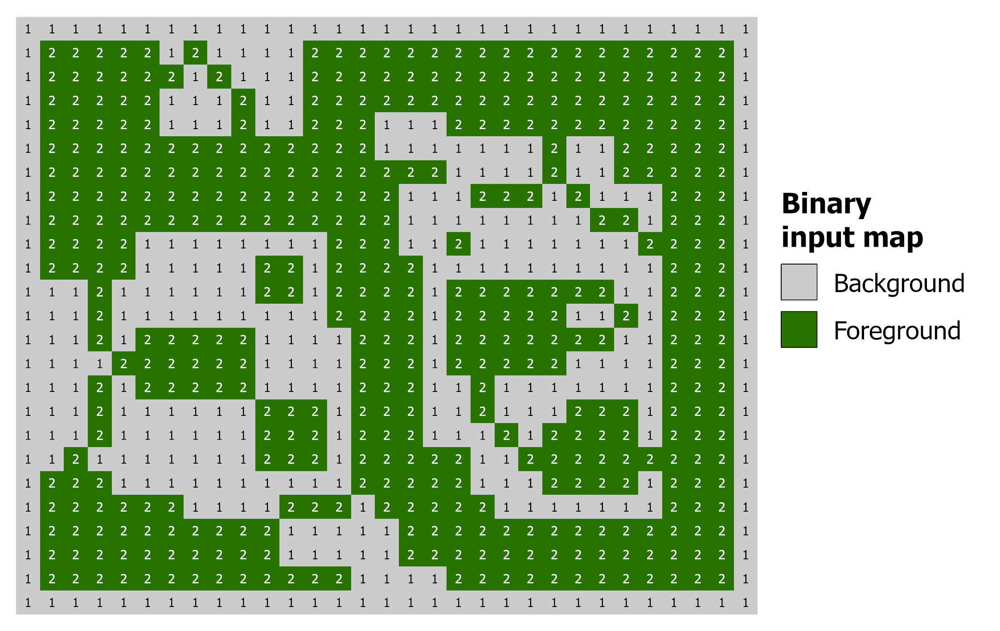
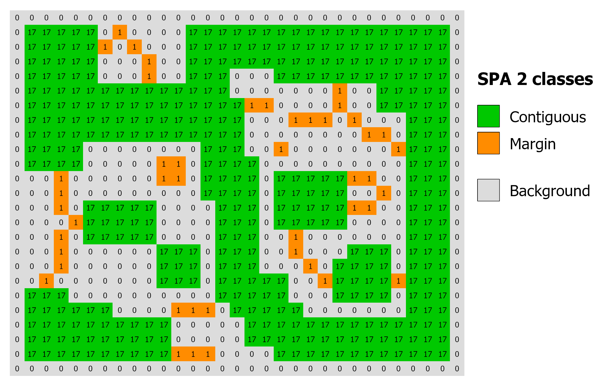
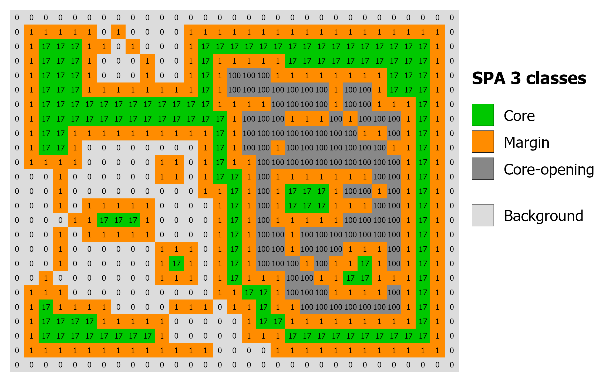
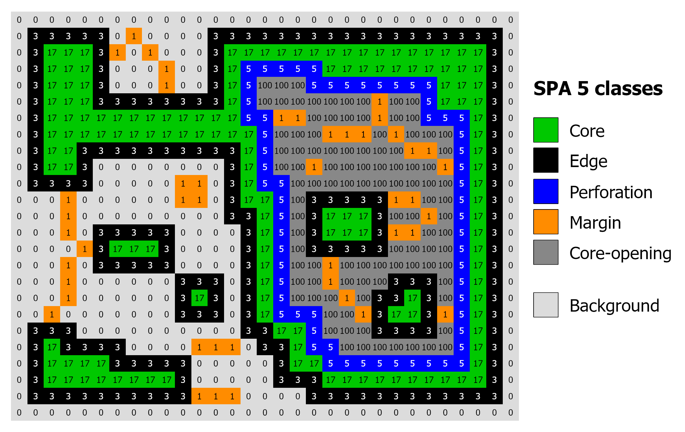
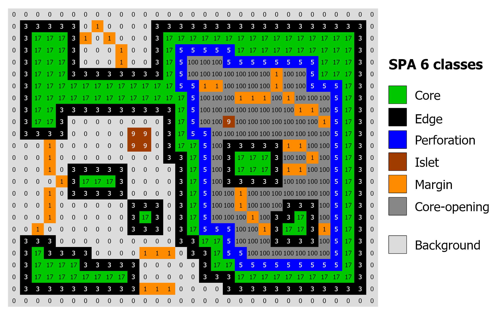

Morphology SPA
==============

Simplified Pattern Analysis (SPA) is a streamlined version of the
MSPA approach. It classifies pixels of a binary foreground/background image into
morphological classes based on their spatial context, offering four different
classification levels (2, 3, 5, or 6 classes).
Further details about SPA and MSPA are available in the `MSPA product sheet
<https://ies-ows.jrc.ec.europa.eu/gtb/GTB/psheets/GTB-Pattern-Morphology.pdf>`_.

.. note::
    SPA is a fast, pure-Python subset of the full morphological segmentation.
    For the complete MSPA classes and connectivity analysis, see
    :doc:`morph_mspa`.

Functions
---------

.. py:function:: pyguidos.spa(in_tiff, edge_width, classes=6, outdir=None, statists=True, stat_files=True, verb=False)

   SPA classifies the foreground of a binary pattern into structural
   categories based on their spatial context, with four classification
   levels (2, 3, 5 or 6 classes).

   :param in_tiff: Path to input GeoTIFF (0=NoData, 1=Background, 2=Foreground).
   :type in_tiff: str or Path
   :param edge_width: Width of the edge zone in pixels (>= 1).
   :type edge_width: int
   :param classes: Number of morphological classes: 2, 3, 5 or 6.
   :type classes: int, optional
   :param outdir: Output directory. If ``None`` (default), outputs are written to the input file's directory.
   :type outdir: str or Path, optional
   :param statists: If ``True``, computes and returns statistics.
   :type statists: bool, optional
   :param stat_files: If ``True``, writes a .txt report file.
   :type stat_files: bool, optional
   :param verb: If ``True``, prints progress messages.
   :type verb: bool, optional

   :returns: **dict** -- A dictionary containing three main sections:

       * ``"output paths"`` (*dict* or *None*):
           * ``"path tif"`` (*str*) -- Absolute path to the result GeoTIFF.
           * ``"path txt"`` (*str*) -- Absolute path to the statistics report.
       * ``"input stats"`` (*dict*):
           * ``"foreground pxl"`` (*int*) -- Count of foreground pixels.
           * ``"background pxl"`` (*int*) -- Count of background pixels.
           * ``"missing pxl"`` (*int*) -- Count of NoData pixels.
       * ``"output stats"`` (*dict*):
           * ``"class freq"`` (*dict*) -- Pixel counts for the SPA classes selected by the ``classes`` parameter.

   :outputs: The function writes the following output files with ``stat_files=True``:

       * ``<input_filename>_spa_<edge_width>_<classes>.tif``: SPA result GeoTIFF with color palette
       * ``<input_filename>_spa_<edge_width>_<classes>.txt``: Statistics report

   .. rubric:: Example
   Standard execution of SPA analysis using the Forest/Non-Forest GeoTIFF
   file of Corsica stored in the ``pyguidos/data`` folder:

   .. code-block:: python

        >>> import pyguidos as pg
        >>> tiff = pg.DATA_DIR / "CLC2018_corsica_FNF.tif"
        >>> spa_result = pg.spa(in_tiff=tiff, edge_width=1, classes=6,
        ... outdir="output/", statists=True, stat_files=True, verb=False)
        >>> spa_result['output stats']['class freq']
        {'1 Core (17)': 200934,
         '2 Edge (3)': 61706,
         '3 Perforation (5)': 9331,
         '4 Islet (9)': 978,
         '5 Margin (1)': 27788,
         '6 Core-opening (100)': 13995,
         '7 Background (0)': 558199,
         '8 Missing (129)': 932069}
        >>> spa_result['output paths']['path tif']
        'output/CLC2018_corsica_FNF_spa_1_6.tif'

.. py:function:: pyguidos.spa_stats(spa_tiff, stat_files=True, outdir=None, source_tiff=None)

   Computes statistics for an existing SPA result GeoTIFF.

   :param spa_tiff: Path to the SPA result GeoTIFF (must carry a ``GTB_SPA`` metadata tag).
   :type spa_tiff: str or Path
   :param stat_files: If ``True``, writes the .txt report file.
   :type stat_files: bool, optional
   :param outdir: Directory for output files. Defaults to the input file's directory.
   :type outdir: str or Path, optional
   :param source_tiff: Path to the original input GeoTIFF used to generate the SPA result.
   :type source_tiff: str or Path, optional

   :returns: **dict** -- A dictionary containing three main sections:

       * ``"output paths"`` (*dict* or *None*):
           * ``"path tif"`` (*str*) -- Absolute path to the used SPA GeoTIFF.
           * ``"path txt"`` (*str*) -- Absolute path to the statistics report.
       * ``"input stats"`` (*dict*):
           * ``"foreground pxl"`` (*int*) -- Count of foreground pixels.
           * ``"background pxl"`` (*int*) -- Count of background pixels.
           * ``"missing pxl"`` (*int*) -- Count of NoData pixels.
       * ``"output stats"`` (*dict*):
           * ``"class freq"`` (*dict*) -- Pixel counts for the SPA classes.

   :outputs: The function writes the following output file with ``stat_files=True``:

       * ``<spa_filename>.txt``: Statistics report

   .. rubric:: Example
   After executing the SPA analysis, pass the resulting GeoTIFF to
   ``spa_stats()`` to extract summary statistics.

   .. code-block:: python

        >>> spa_tiff = 'output/CLC2018_corsica_FNF_spa_1_6.tif'
        >>> spa_stats = pg.spa_stats(spa_tiff=spa_tiff, stat_files=True,
        ... outdir='output/', source_tiff=None)
        >>> spa_stats['input stats']['foreground pxl']
        314732

Output Classes
--------------

The number of morphological classes in the output depends on the ``classes``
parameter. The following table describes the byte values and categories for
each level:

.. list-table:: SPA Class names and byte values.
   :widths: 20 20 60
   :header-rows: 1

   * - Level
     - Byte Value
     - Class Name
   * - **2 classes**
     - 17, 1
     - Contiguous, Margin
   * - **3 classes**
     - 17, 1, 100
     - Core, Margin, Core Opening
   * - **5 classes**
     - 17, 3, 5, 1, 100
     - Core, Edge, Perforation, Margin, Core Opening
   * - **6 classes**
     - 17, 3, 5, 9, 1, 100
     - Core, Edge, Perforation, Islet, Margin, Core Opening

.. note::
    In all modes, Background is represented by value **0**, and No Data is represented by **129**.

    Example of input binary map used for SPA.

    Derived SPA maps with 2, 3, 5 and 6 classes and edge width 1.

References
----------

- Vogt P, Riitters K, 2017. GuidosToolbox: universal digital image object analysis.
  European Journal of Remote Sensing 50(1), 352-361. DOI: `10.1080/22797254.2017.1330650
  <https://doi.org/10.1080/22797254.2017.1330650>`_.

- Soille P, Vogt P, 2009. Morphological segmentation of binary patterns. Pattern Recognition
  Letters 30(4):456-459. DOI: `10.1016/j.patrec.2008.10.015
  <https://doi.org/10.1016/j.patrec.2008.10.015>`_.
