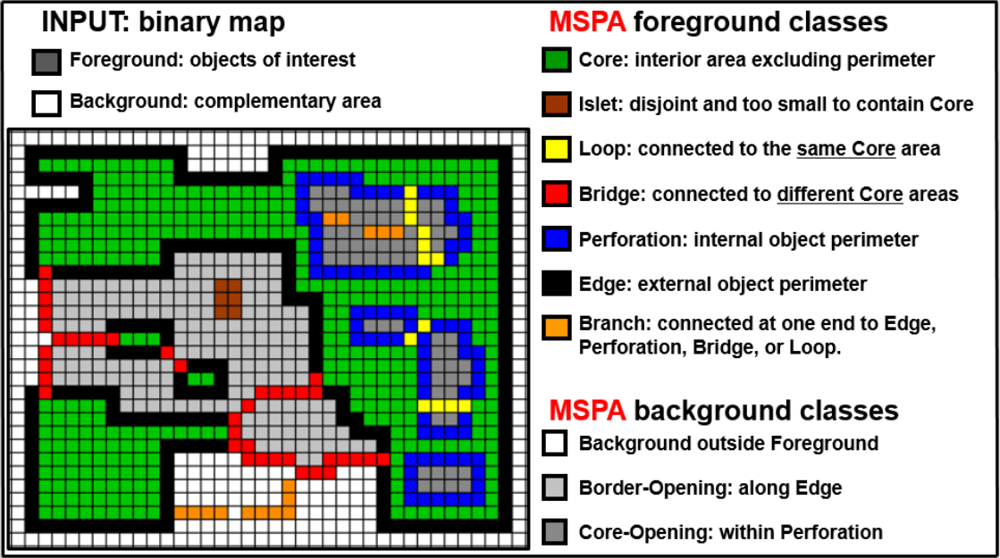

Morphology (MSPA)
=================

Morphological Spatial Pattern Analysis (MSPA) is a multi-scale image
processing approach that classifies the pixels of a binary foreground/background
image into mutually exclusive morphological classes based on their spatial
context. Further details about MSPA are available in the
`MSPA product sheet
<https://ies-ows.jrc.ec.europa.eu/gtb/GTB/psheets/GTB-Pattern-Morphology.pdf>`_.

MSPA Classes
------------

The Morphological Spatial Pattern Analysis (MSPA) classifies input map pixels into 
distinct structural categories based on their geometry and connectivity. The number 
of classes varies if the analysis is performed diversifying the features on the 
outer and inner of perforations using the ``int_ext`` parameter.

With ``int_ext = True`` (default), the foreground classes are 
21 and the background classes are 3. With ``int_ext = False``, the 
resulted foreground classes are 11 plus 1 background class. 

Results are finally aggregated into the 7 main foreground feature classes 
(Core, Islet, Perforation, Edge, Loop, Bridge, Branch) and 3 background 
feature classes (Background, Border-Opening, Core-Opening).

.. list-table:: Class names, color codes, and byte values for MSPA feature classes.
   :widths: 15 10 15 30 30
   :header-rows: 1

   * - Class
     - Color
     - RGB
     - int_ext = False
     - int_ext = True        
        External - Internal
   * - Core
     - Green
     - 000/200/000
     - 17
     - 117
   * - Islet
     - Brown
     - 160/060/000
     - 9
     - 109
   * - Perforation
     - Blue
     - 000/000/255
     - 5
     - 105
   * - Edge
     - Black
     - 000/000/000
     - 3
     - 103
   * - Loop
     - Yellow
     - 255/255/000
     - 65
     - 165
   * - Loop in Edge
     - Yellow
     - 255/255/000
     - 67
     - 167
   * - Loop in Perforation
     - Yellow
     - 255/255/000
     - 69
     - 169
   * - Bridge
     - Red
     - 255/000/000
     - 33
     - 133
   * - Bridge in Edge
     - Red
     - 255/000/000
     - 35
     - 135
   * - Bridge in Perforation
     - Red
     - 255/000/000
     - 37
     - 137
   * - Branch
     - Orange
     - 255/140/000
     - 1
     - 101
   * - Background
     - Light Grey
     - 220/220/220
     - 0
     - 0
   * - Border-Opening
     - Grey
     - 194/194/194
     - N/A
     - 220
   * - Core-Opening
     - Dark Grey
     - 136/136/136
     - N/A
     - 100
   * - No Data
     - White
     - 255/255/255
     - 129
     - 129

    Map and list of the 7 aggregated feature classes of MSPA.

Usage
-----

.. code-block:: python

    import pyguidos as pg

    result = pg.mspa(
        in_tiff="my_map.tif",
        edge_width=1,
        connectivity=8,
        transition=True,
        int_ext=True,
        outdir="output/",
        statists=True,
        stat_files=True,
        return_array=False,
        verb=False
    )

Parameters
----------

.. list-table::
   :header-rows: 1

   * - Parameter
     - Type
     - Default
     - Description
   * - ``in_tiff``
     - str or Path
     - --
     - Path to input GeoTIFF
   * - ``edge_width``
     - int
     - --
     - Edge width in pixels, >= 1
   * - ``connectivity``
     - int
     - 8
     - Pixel connectivity, 4 or 8
   * - ``transition``
     - bool
     - True
     - Enable transition zones
   * - ``int_ext``
     - bool
     - True
     - Distinguish internal/external subclasses
   * - ``outdir``
     - str or Path
     - None
     - Output directory
   * - ``statists``
     - bool
     - True
     - Compute statistics
   * - ``stat_files``
     - bool
     - True
     - Write statistics to files
   * - ``return_array``
     - bool
     - False
     - Return output array
   * - ``verb``
     - bool
     - False
     - Print progress messages

Output Files
------------

.. list-table::
   :header-rows: 1

   * - File
     - Description
   * - ``<name>_mspa_<conn>_<ew>_<tr>_<ie>.tif``
     - MSPA result GeoTIFF with colour palette
   * - ``<name>_mspa_<conn>_<ew>_<tr>_<ie>.txt``
     - Statistics report

Result Object
-------------

:func:`mspa` returns an :class:`MSPAResult` dataclass:

.. code-block:: python

    result = pg.mspa("my_map.tif", edge_width=1)

    # Access statistics
    print(result.stats.keys())
    # dict_keys(['output paths', 'input stats', 'output stats'])

    # Input pixel counts
    print(result.stats["input stats"])
    # {'foreground pxl': 12500, 'background pxl': 37500, 'missing pxl': 0}

    # Per-class pixel counts
    print(result.stats["output stats"])
    # {'core pxl': 8200, 'edge pxl': 2100, 'perforation pxl': 500, ...}

    # Output file paths
    print(result.stats["output paths"])
    # {'path tif': 'output/my_map_mspa_8_1_1_1.tif',
    #  'path txt': 'output/my_map_mspa_8_1_1_1.txt'}

    # Access array (only if return_array=True)
    print(result.array)

.. note::
    ``result.stats["output paths"]`` is ``None`` when ``stat_files=False``.
    All other keys are always populated regardless of ``stat_files``.

Computing Statistics Separately
--------------------------------

If you already have an MSPA output GeoTIFF, you can compute statistics
without rerunning the analysis:

.. code-block:: python

    stats = pg.mspa_stats(
        mspa_tiff="output/my_map_mspa_8_1_1_1.tif",
        outfile=True,
        outdir="output/",
        source_tiff="my_map.tif"
    )

.. note::
    :func:`mspa_stats` requires the input GeoTIFF to be an pyGuidos (or
    GTB) output raster file. See :doc:`input_format` for details.

References
----------

- Vogt P, Riitters K, 2017. GuidosToolbox: universal digital image object analysis. 
  European Journal of Remote Sensing 50(1), 352-361. DOI: `10.1080/22797254.2017.1330650 
  <https://doi.org/10.1080/22797254.2017.1330650>`_.

- Soille P, Vogt P, 2009. Morphological segmentation of binary patterns. Pattern Recognition
  Letters 30(4):456-459. DOI: `10.1016/j.patrec.2008.10.015 
  <https://doi.org/10.1080/22797254.2017.1330650>`_
